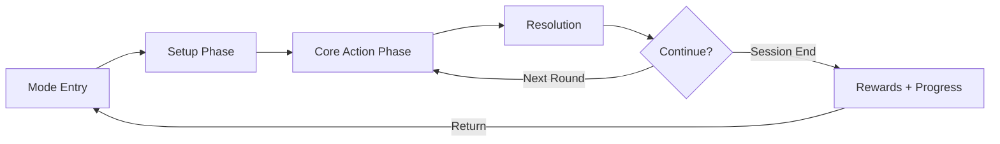
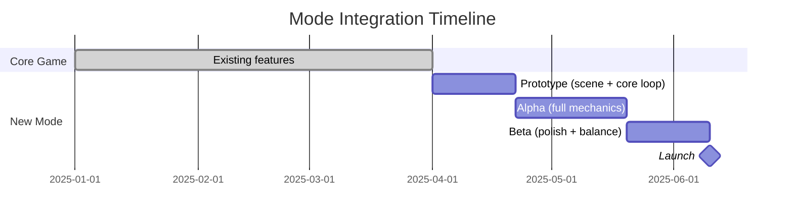

# PRD Template — Game Mode Addition

신규 게임 모드 PRD 작성을 위한 섹션별 상세 가이드와 예시.
기존 Solitary 코드베이스 위에 새 게임 모드를 추가하는 맥락을 전제한다.

---

## 1. Executive Summary

**Template**:
```markdown
## Executive Summary

**Mode Name**: {Game Mode Name}
**Genre Tags**: {e.g., Solitaire + Tower Defense, Solitaire + Roguelike}
**Base Game**: Solitary — Klondike Solitaire

### Key Differentiators (vs Core Solitaire)
1. {Differentiator 1 — new mechanic or twist}
2. {Differentiator 2}
3. {Differentiator 3}

### Concept
{2-3 sentences. Format: "In [Mode Name], the classic solitaire mechanics are [how they're used/transformed]. Players [core new action], creating [new experience]."}
```

---

## 2. Mode Vision & Goals

**Template**:
```markdown
## Mode Vision & Goals

### Value Proposition
{Why this mode exists in the project. What player need does it serve that core solitaire doesn't?}

### Success Criteria
| Metric | Target | Measurement |
|--------|--------|-------------|
| Mode adoption rate | > {X}% of active users try within 7 days | Analytics |
| Mode session share | > {X}% of total sessions | Analytics |
| Mode D7 retention | > {X}% | Cohort |
| Cross-mode engagement | {X}% play both modes weekly | Analytics |
```

---

## 3. Target Players & Personas

**Persona Template**:
```markdown
### Persona: {Name}
- **Profile**: {Casual / Midcore / Hardcore}
- **Relationship to Core Solitaire**: {Daily player / Occasional / New to solitaire}
- **Play Sessions**: {Duration and frequency}
- **Motivations**: {What draws them to this mode specifically}
- **Pain Points**: {What they find lacking in pure solitaire}
```

Include at least:
- 1 persona who is an existing solitaire player seeking variety
- 1 persona who is drawn by the new mode's genre (e.g., defense, roguelike)

---

## 4. Core Loop & Session Design

**Core Loop Diagram (Mermaid)**:


Adapt phases from the GDD. Clearly mark where solitaire mechanics intersect.

**Session Comparison**:
| Aspect | Core Solitaire | New Mode |
|--------|---------------|----------|
| Session Length | 3-10 min | {Target} |
| Win Condition | All cards to foundation | {New condition} |
| Fail Condition | No moves available | {New condition} |
| Replayability | Seed-based | {Mechanism} |

**FTUE (First Time User Experience)**:
1. {How the mode is discovered / accessed from the main menu}
2. {Tutorial: which mechanics are assumed known vs taught}
3. {First success moment}
4. {Transition to unguided play}

---

## 5. Shared Infrastructure

**Reuse Matrix**:
| Component | File | Reuse Strategy |
|-----------|------|---------------|
| GameBridge | `game/bridge/GameBridge.ts` | Reuse as-is (multi-bridge via bridgeId) |
| CardSprite | `game/objects/CardSprite.ts` | Reuse as-is |
| CardRenderer | `game/rendering/CardRenderer.ts` | Reuse (same textures) |
| LayoutManager | `game/rendering/LayoutManager.ts` | New instance or extend |
| SpriteManager | `game/sprites/SpriteManager.ts` | Extend or new (different pile layout) |
| InteractionController | `game/interaction/InteractionController.ts` | Extend (new drop targets) |
| ThemeManager | `game/rendering/ThemeManager.ts` | Reuse as-is |
| SolitaireCore | `game/core/SolitaireCore.ts` | Reference or wrap |
| SolitaireState | `solver/SolitaireState.ts` | Reference (solitaire sub-state) |
| NestedRolloutSolver | `solver/NestedRolloutSolver.ts` | Optional (hint system) |
| Deck | `solver/Deck.ts` | Reuse (seeded shuffle) |
| useGameState | `hooks/useGameState.ts` | New hook or extend |

**Solitaire Core Reference**:
- 어떤 솔리테어 규칙을 그대로 사용하는지 (예: tableau stacking, foundation building)
- 어떤 규칙을 변형하는지
- 신규 모드 전용 규칙

---

## 6. Feature Requirements (MoSCoW)

**Template**:
| Priority | Feature | New / Reuse | GDD Source | Acceptance Criteria |
|----------|---------|-------------|------------|-------------------|
| **Must** | {Feature} | New | `[GDD: {file}]` | {Testable criteria} |
| **Must** | {Feature} | Reuse: `{component}` | `[GDD: {file}]` | {Criteria} |
| **Should** | {Feature} | Extend: `{component}` | `[GDD: {file}]` | {Criteria} |
| **Could** | {Feature} | New | `[GDD: {file}]` | {Criteria} |
| **Won't** | {Feature} | — | — | {Reason for exclusion} |

**Rules**:
- "New / Reuse / Extend" 열로 구현 전략 명시
- Reuse/Extend 시 대상 컴포넌트의 실제 클래스명/파일명 참조
- Won't 항목은 제외 사유 명시

---

## 7. Monetization Impact

**Template**:
```markdown
## Monetization Impact

### Existing Revenue Model
{Current model: F2P, Premium, etc.}

### Mode-Specific Opportunities
| Opportunity | Type | Revenue Estimate | Priority |
|------------|------|-----------------|----------|
| {e.g., Mode-specific cosmetics} | IAP | {Est.} | {Must/Should/Could} |
| {e.g., Premium mode unlock} | IAP | {Est.} | {Priority} |

### Cannibalization Risk
{Does this mode compete with existing monetization or complement it?}
```

---

## 8. KPI Framework

**Mode-Specific KPIs**:
| KPI | Formula | Target |
|-----|---------|--------|
| Mode Entry Rate | Mode sessions / Total sessions | > {X}% |
| Mode Completion Rate | Completed rounds / Started rounds | > {X}% |
| Mode Session Length | Avg time in mode per session | {X} min |
| Cross-Mode Ratio | Users playing both modes / Total users | > {X}% |
| Mode-Specific Win Rate | Wins / Total mode games | {X}% |

**Impact on Existing KPIs**:
| Existing KPI | Expected Impact | Monitoring Plan |
|-------------|----------------|-----------------|
| Overall D1 Retention | {+/- X%} | A/B test: with/without mode |
| Total Session Count | {+X sessions/user/day} | Pre/post comparison |
| Avg Session Length | {Increase/Decrease} | Segmented analysis |

---

## 9. Competitive Reference

**Comparison Table**:
| Game | Mode/Feature | Similarity | Our Advantage |
|------|-------------|-----------|---------------|
| {Competitor 1} | {Their similar feature} | {What's similar} | {Our edge} |
| {Competitor 2} | {Their similar feature} | {What's similar} | {Our edge} |

---

## 10. Release Plan

**Integration with Existing Release Cycle**:


**Milestone Table**:
| Phase | Duration | Deliverables | Gate Criteria |
|-------|----------|-------------|---------------|
| Prototype | {X weeks} | New scene boots, core loop playable | Internal playtest |
| Alpha | {X weeks} | All Must features, placeholder FX | Feature complete |
| Beta | {X weeks} | Polish, balance, performance | D1 > {X}%, no P0 bugs |
| Launch | — | Public release, analytics live | KPI targets met |

---

## 11. Risks & Mitigations

**Template**:
| # | Risk | Category | Prob. | Impact | Mitigation |
|---|------|----------|-------|--------|------------|
| R1 | Code complexity increase | Technical | Med | Med | Isolate in new scene, share via composition |
| R2 | User fragmentation between modes | Product | Med | High | Cross-mode rewards, unified progression |
| R3 | Scope creep from GDD ambition | Process | High | High | Strict MoSCoW enforcement |
| R4 | Performance regression in core game | Technical | Low | High | Independent scene, shared asset budget |

---

## 12. Appendix

### GDD Cross-Reference Table
| PRD Section | GDD Document | GDD Section |
|-------------|-------------|-------------|
| Core Loop | `01-phase-loop.md` | Phase structure |
| Features | `02-*.md` | Mechanics detail |

### Glossary
| Term | Definition |
|------|-----------|
| Core Solitaire | The existing Klondike solitaire mode in Solitary |
| Game Mode | A distinct play experience sharing the same codebase and card engine |
| GameBridge | React ↔ Phaser communication layer (registry-based, multi-instance) |
