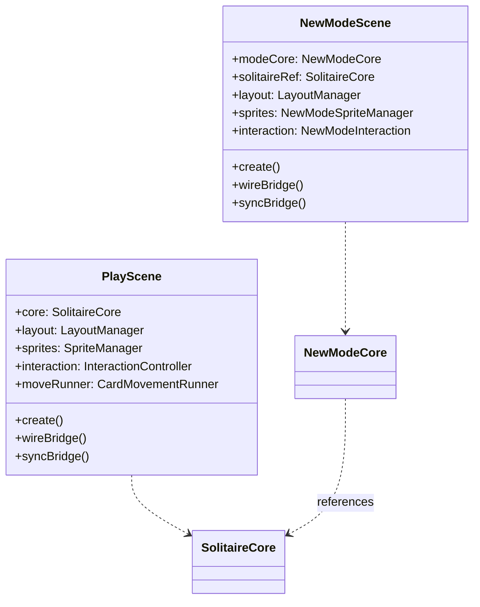
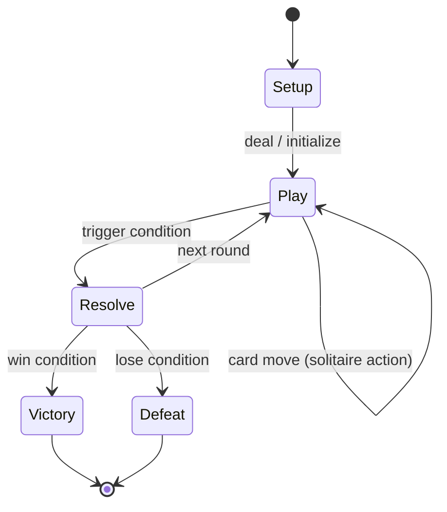

# TRD Template — Game Mode Addition

신규 게임 모드 TRD 작성을 위한 섹션별 상세 가이드, 다이어그램 예시, 인터페이스 템플릿.
기존 Solitary 코드베이스(`PlayScene`, `GameBridge`, `SolitaireCore` 등)을 확장하는 맥락을 전제한다.

---

## 1. Technical Overview

**Template**:
```markdown
## Technical Overview

### System Summary
This TRD defines the technical architecture for **{Mode Name}**, a new game mode
added to the Solitary project. It introduces:
- **New**: {NewScene}.ts, {NewCore}.ts, {NewState}.ts, ...
- **Extended**: GameBridge (new events), SpriteManager (new pile types), ...
- **Reused as-is**: CardSprite, CardRenderer, ThemeManager, Deck, ...

### Architecture Principles
1. **Scene isolation**: New mode runs in its own Phaser Scene, not modifying PlayScene
2. **Bridge pattern compliance**: All React ↔ Phaser communication via GameBridge
3. **Core/Scene separation**: Pure game logic in a Core class, rendering in Scene
4. **Composition over inheritance**: Wrap SolitaireCore/State, don't subclass

### Technical Constraints
- Runtime: Browser (Chrome 90+, Safari 15+, Mobile browsers)
- Framework: Phaser 3.80+ (WebGL with Canvas fallback)
- Language: TypeScript 5.x (strict mode)
- Bundle: Next.js 16 (tree-shaking, dynamic imports)
- No native dependencies (pure browser APIs)
```

---

## 2. Scene Architecture

**Scene Class Diagram (Mermaid)**:


**Scene Lifecycle**:
```markdown
### Scene Lifecycle

1. **preload**: No-op (textures generated in create via CardRenderer)
2. **create**:
   - Initialize NewModeCore (wrapping or referencing SolitaireCore)
   - Create LayoutManager with mode-specific dimensions
   - Generate card textures via CardRenderer.generateTextures()
   - Build sprites from initial state
   - Wire bridge callbacks
   - Sync initial state to React
3. **update(time, delta)**: {Per-frame logic if needed, e.g., timer, enemy AI}
4. **shutdown**: Clear bridge callbacks, destroy sprites
```

**Scene Transition**:
```markdown
### Scene Transition Strategy

Option A — Route-based (recommended):
- `/play` → PlayScene (existing)
- `/{mode-slug}` → NewModeScene (new route + page component)
- Each route creates its own Phaser.Game instance via PhaserGameInner

Option B — Phaser SceneManager:
- Single Phaser.Game, switch scenes via scene.start('{key}')
- Requires scene registry in game config
- More complex lifecycle management
```

---

## 3. Game State & Core Logic

**State Interface Template**:
```typescript
// game/core/{mode}/NewModeState.ts

interface NewModeState {
  /** Solitaire sub-state (card piles, foundation, etc.) */
  solitaire: SolverSnapshot;

  /** Mode-specific state */
  phase: GamePhase;              // Current game phase
  round: number;                 // Current round/wave number
  score: number;                 // Mode-specific scoring
  // ... mode-specific fields

  /** Meta */
  seed: number;
  moveCount: number;
}

enum GamePhase {
  SETUP = 'setup',
  PLAY = 'play',
  RESOLVE = 'resolve',
  // ... mode-specific phases
}
```

**State Machine (Mermaid)**:


**Core Class Pattern**:
```typescript
// game/core/{mode}/NewModeCore.ts

class NewModeCore {
  private state: NewModeState;
  private solitaireCore: SolitaireCore;  // composition
  private undoStack: NewModeState[];
  private emitter: EventEmitter;

  // Delegate solitaire operations
  executeSolitaireMove(move: Move): MoveResult { ... }

  // Mode-specific operations
  executePhaseAction(action: PhaseAction): ActionResult { ... }
  advancePhase(): void { ... }

  // State access
  getDisplayState(): NewModeDisplayState { ... }
  getSerializableState(): NewModeSnapshot { ... }

  // Events
  on<K extends keyof NewModeCoreEvents>(event: K, cb: Listener): void { ... }
}
```

---

## 4. GameBridge Event Extensions

**Existing Events (reusable)**:
| Event | Payload | Used For |
|-------|---------|----------|
| `stateChanged` | GameDisplayState | UI update after move |
| `gameWon` | — | Win screen trigger |
| `undo` | — | Undo request from React |
| `newGame` | — | New game request |
| `setTheme` | themeId: string | Theme change |

**New Events Template**:
```typescript
// game/bridge/events.ts (extend or new file)

interface NewModeEvents {
  /** Emitted when mode-specific state changes */
  'modeStateChanged': (state: NewModeDisplayState) => void;

  /** Emitted when phase transitions */
  'phaseChanged': (phase: GamePhase, data?: PhaseData) => void;

  /** Emitted on mode-specific game over (distinct from solitaire win) */
  'modeGameOver': (result: { won: boolean; score: number }) => void;

  // ... additional mode events
}
```

**Callback Extensions**:
```typescript
// Add to GameBridge interface
interface GameBridge {
  // Existing callbacks...

  // New mode callbacks
  newModeActionCallback: ((action: PhaseAction) => void) | null;
  // ...
}
```

---

## 5. Rendering & Layout

**Layout Configuration**:
```typescript
// game/rendering/{mode}/NewModeLayout.ts

interface NewModeLayoutConfig {
  // Solitaire area (subset of screen)
  solitaireArea: { x, y, width, height };

  // Mode-specific areas
  boardArea: { x, y, width, height };
  hudArea: { x, y, width, height };

  // Card sizing (may differ from standard solitaire)
  cardWidth: number;
  cardHeight: number;
}
```

**Layer/Depth Strategy**:
| Layer | Depth Range | Contents |
|-------|------------|----------|
| Background | 0-99 | Board background, zone outlines |
| Cards (static) | 100-999 | Cards in piles |
| Cards (dragging) | 10000+ | Active drag sprites |
| UI Overlay | 20000+ | HUD elements, timers, score |
| Effects | 30000+ | Particles, animations |

---

## 6. Interaction Design

**Template**:
```markdown
### Interaction Map

| Input | Context | Action | Handler |
|-------|---------|--------|---------|
| Click | Card in tableau | Select/Deselect | InteractionController |
| Drag + Drop | Card → Tableau | Solitaire move | InteractionController → Core |
| Click | Mode-specific button | Phase action | Scene method |
| Double-click | Card | Auto-move to foundation | InteractionController |
| {New input} | {Context} | {New action} | {Handler} |
```

**DropTargetResolver Extension**:
```typescript
// If new drop targets needed:
// Extend DropTargetResolver.findTarget() or create mode-specific resolver

interface DropTarget {
  pile: PileType;    // Extend PileType enum if needed
  index: number;
  // mode-specific target info
}
```

---

## 7. Entity & Component Design

**New Game Objects**:
| Object | Base Class | Description |
|--------|-----------|-------------|
| {NewEntity} | Phaser.GameObjects.Container | {Purpose} |
| {ModeHUD} | Phaser.GameObjects.Container | {Score, timer, phase info} |

**SpriteManager Extension**:
```markdown
Option A: Extend existing SpriteManager with mode-specific piles
Option B: Create NewModeSpriteManager (recommended for complex modes)
  - Reuse CardSprite creation logic
  - Add mode-specific pile arrays
  - Override rebuild() for mode layout
```

---

## 8. AI & Solver Adaptation

**Decision Matrix**:
| Question | If Yes | If No |
|----------|--------|-------|
| Does the mode use standard solitaire moves? | Reuse NestedRolloutSolver for hint | Custom hint logic |
| Does the mode add new move types? | Extend Move interface + getOrderedMoves() | N/A |
| Is auto-solve needed? | Extend Worker protocol | Skip |
| Is AI opponent needed? | New AI module | Skip |

**Worker Protocol Extension** (if needed):
```typescript
// solver/workerProtocol.ts extension

type WorkerRequest =
  | { type: 'solve'; state; n0; n1; maxTime }
  | { type: 'hint'; state; maxTime }
  | { type: 'cancel' }
  | { type: 'modeHint'; modeState: NewModeSnapshot; maxTime: number }  // NEW
```

---

## 9. Animation & Effects

**Reuse**:
- CardMovementRunner: All card movement animations (Sine, Spiral, etc.)
- HintRenderer: Hint glow effects (if hint system used)

**New Effects**:
| Effect | Trigger | Description | Implementation |
|--------|---------|-------------|---------------|
| {Phase transition} | Phase change | {Visual effect} | New renderer in `game/effects/` |
| {Mode win} | Game won | {Celebration} | Extend WinEffectRenderer or new |
| {Mode-specific} | {Event} | {Description} | {Approach} |

---

## 10. Audio Design

**Template**:
| Category | Trigger | Asset | Notes |
|----------|---------|-------|-------|
| SFX | Card move | Reuse existing | Same card flip/place sounds |
| SFX | {Mode action} | New | {Description} |
| BGM | Mode entry | New | {Mood, tempo} |
| BGM | {Phase change} | Crossfade | {Transition style} |

---

## 11. React Integration

**New Components**:
| Component | Path | Description |
|-----------|------|-------------|
| {ModePage} | `app/{mode-slug}/page.tsx` | Next.js route page |
| {ModeControls} | `components/{ModeControls}.tsx` | Mode-specific UI |
| {ModeHUD} | `components/{ModeHUD}.tsx` | In-game overlay |

**Hook Template**:
```typescript
// hooks/use{Mode}State.ts

function useModeState(bridgeId: string) {
  const [state, setState] = useState<NewModeDisplayState | null>(null);

  useEffect(() => {
    const bridge = getBridge(bridgeId);
    const handler = (s: NewModeDisplayState) => setState(s);
    bridge.on('modeStateChanged', handler);
    return () => bridge.off('modeStateChanged', handler);
  }, [bridgeId]);

  return {
    state,
    phase: state?.phase ?? null,
    score: state?.score ?? 0,
    // mode-specific derived state
  };
}
```

---

## 12. Performance Budget

| Metric | Core Solitaire | New Mode Budget | Combined Max |
|--------|---------------|-----------------|-------------|
| Memory (heap) | ~30 MB | +{X} MB | {Total} MB |
| JS Bundle | ~{X} KB | +{Y} KB | {Total} KB |
| FPS (target) | 60 | 60 | 60 |
| Scene init time | < 500ms | < {X}ms | — |
| Card textures | 53 textures | +{X} textures | Shared |

**Rules**:
- New mode MUST NOT degrade core solitaire performance
- Card textures shared (CardRenderer generates once)
- Mode-specific assets loaded lazily (dynamic import)

---

## 13. Analytics & Events

**Event Taxonomy** (20-30 sample events):
| Event Name | Category | Trigger | Properties |
|-----------|----------|---------|------------|
| `mode_entered` | Navigation | User opens mode | `{ mode, source }` |
| `mode_game_started` | Session | New game initiated | `{ mode, seed }` |
| `mode_round_started` | Gameplay | Round begins | `{ mode, round }` |
| `mode_card_moved` | Gameplay | Card moved | `{ mode, actionType, round }` |
| `mode_phase_changed` | Gameplay | Phase transition | `{ mode, from, to }` |
| `mode_round_completed` | Gameplay | Round ends | `{ mode, round, score }` |
| `mode_game_won` | Session | Victory | `{ mode, score, rounds, duration }` |
| `mode_game_lost` | Session | Defeat | `{ mode, score, rounds, duration, reason }` |
| `mode_hint_used` | Assistance | Hint requested | `{ mode, round }` |
| `mode_undo_used` | Assistance | Undo triggered | `{ mode, round }` |
| `mode_settings_changed` | Settings | Config changed | `{ mode, setting, value }` |

**Naming Convention**: Prefix with `mode_` to distinguish from core solitaire events.

---

## 14. Testing Strategy

| Type | Scope | Tool | Coverage Target |
|------|-------|------|----------------|
| Unit | NewModeCore, NewModeState | `npx tsx test-{mode}.ts` | All state transitions, edge cases |
| Unit | Evaluator extension (if any) | `npx tsx test-{mode}.ts` | Heuristic accuracy |
| Integration | Scene + Core + Bridge | Manual / Playwright | All user flows |
| Regression | PlayScene, SolitaireCore | Existing `test-solver.ts` | No breakage |
| Visual | Card rendering, layout | Screenshot comparison | Layout correctness |
| Performance | Scene init, FPS, memory | Chrome DevTools / Lighthouse | Within budget |

---

## 15. File Structure

**Template**:
```
web/src/
  app/
    {mode-slug}/
      page.tsx                    # NEW - Next.js route
  components/
    {ModeControls}.tsx            # NEW - Mode UI
  game/
    scenes/
      {NewModeScene}.ts           # NEW - Phaser scene
    core/
      {mode}/
        {NewModeCore}.ts          # NEW - Pure game logic
        {NewModeState}.ts         # NEW - State types
        events.ts                 # NEW - Mode event types
    sprites/
      {NewModeSpriteManager}.ts   # NEW or extend - Sprite management
    interaction/
      {NewModeInteraction}.ts     # NEW or extend - Input handling
    effects/
      {NewModeEffects}.ts         # NEW - Mode-specific effects
    rendering/
      {NewModeLayout}.ts          # NEW - Layout configuration
  hooks/
    use{Mode}State.ts             # NEW - React state hook
  solver/
    {ModeEvaluator}.ts            # NEW (if needed) - Mode heuristics
```

---

## 16. Appendix

### GDD / PRD Cross-Reference
| TRD Section | PRD Feature | GDD Source |
|-------------|------------|------------|
| Scene Architecture | {Feature from PRD} | `[GDD: {filename}]` |
| State Management | {Feature from PRD} | `[GDD: {filename}]` |

### Architecture Decision Records (ADR)

**ADR Template**:
```markdown
#### ADR-{N}: {Decision Title}
- **Status**: Proposed / Accepted / Deprecated
- **Context**: {Why this decision is needed}
- **Decision**: {What was decided}
- **Alternatives Considered**: {Other options and why they were rejected}
- **Consequences**: {Impact of this decision}
```
