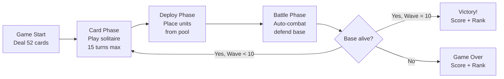
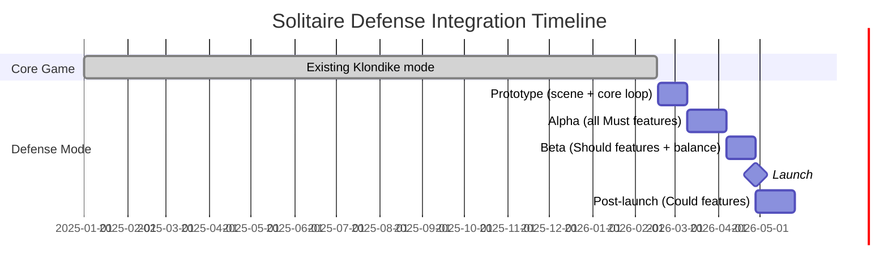

# PRD: Solitaire Defense Mode

## 1. Executive Summary

**Mode Name**: Solitaire Defense
**Genre Tags**: Solitaire + Tower Defense, Card Strategy
**Base Game**: Solitary -- Klondike Solitaire with AI Solver

### Key Differentiators (vs Core Solitaire)
1. **Foundation-as-Barracks**: Every card placed on a Foundation spawns a combat unit, turning solitaire progress into military power.
2. **Suit-Driven Strategy**: Each of the 4 Suits maps to a unique unit class (tank, healer, ranged, AoE), and enemies may resist specific Suits -- forcing players to plan which Suits to prioritize during card play.
3. **Wave Defense Loop**: A 10-wave campaign wraps around the solitaire tableau, preserving the 52-card deck across waves and creating a long-arc resource puzzle.

### Concept
In Solitaire Defense, the classic Klondike Solitaire mechanics serve as a real-time army builder. Players alternate between Card Phases (playing solitaire under turn limits to stack cards onto Foundations) and Battle Phases (watching their assembled units defend a base against escalating enemy waves). The strategic tension lies in *which* cards to prioritize -- every Foundation placement is simultaneously a solitaire optimization problem and a military resource decision.

---

## 2. Mode Vision & Goals

### Value Proposition
Core solitaire provides a satisfying puzzle experience but lacks external goals beyond completion. Solitaire Defense adds a persistent meta-objective -- defending a base across 10 waves -- that gives every solitaire decision stakes beyond the tableau. This attracts strategy gamers who find pure solitaire too passive, while giving solitaire enthusiasts a new reason to optimize their play.

### Success Criteria
| Metric | Target | Measurement |
|--------|--------|-------------|
| Mode adoption rate | > 40% of active users try within 7 days | Analytics |
| Mode session share | > 25% of total sessions | Analytics |
| Mode D7 retention | > 30% | Cohort |
| Cross-mode engagement | 60% play both modes weekly | Analytics |
| Avg session length | 15-25 min (defense), vs 5-10 min (core) | Analytics |

---

## 3. Target Players & Personas

### Persona: Solitaire Sophie
- **Profile**: Casual
- **Relationship to Core Solitaire**: Daily player, 3+ sessions/day
- **Play Sessions**: 5-15 min per session, plays during breaks
- **Motivations**: Seeking variety without learning a completely new game; wants her solitaire skills to "mean something" beyond win/loss
- **Pain Points**: Core solitaire feels repetitive after months; no progression system

### Persona: Strategy Steve
- **Profile**: Midcore
- **Relationship to Core Solitaire**: Occasional player, prefers strategy games
- **Play Sessions**: 20-40 min dedicated sessions
- **Motivations**: Drawn by the tower defense + card strategy hybrid; enjoys optimizing unit compositions and adapting to enemy types
- **Pain Points**: Pure solitaire lacks the strategic depth he craves; typical tower defense games lack the puzzle element

### Persona: Completionist Clara
- **Profile**: Hardcore
- **Relationship to Core Solitaire**: Experienced player, seeks S-rank on every seed
- **Play Sessions**: 30-60 min per session, focused optimization
- **Motivations**: Chasing S-rank scores, champion unit unlocks, and leaderboard positions
- **Pain Points**: Core solitaire has a binary outcome (win/lose); wants granular achievement tracking

---

## 4. Core Loop & Session Design

### Core Loop Diagram

### Solitaire Intersection Points
- **Card Phase** uses 100% standard Klondike rules (reuses `SolitaireCore`, `SolitaireState`)
- Every `TABLEAU_TO_FOUNDATION` or `WASTE_TO_FOUNDATION` move triggers a unit spawn event
- Tableau/Stock/Waste state persists across waves (same 52-card deck, continuous game)

### Session Comparison
| Aspect | Core Solitaire | Solitaire Defense |
|--------|---------------|-------------------|
| Session Length | 3-10 min | 15-25 min |
| Win Condition | All 52 cards to foundation | Survive 10 waves |
| Fail Condition | No moves available | Base HP reaches 0 |
| Replayability | Seed-based | Seed + wave composition + suit affinity randomization |
| Scoring | Win/Lose binary | Multi-factor score (S/A/B/C/D ranking) |

### FTUE (First Time User Experience)
1. **Discovery**: "Defense Mode" button on main menu (`/`), with a brief tagline: "Your solitaire skills build an army"
2. **Tutorial Wave (Wave 1)**: Extended turn limit (20 turns), only Grunt enemies. In-game tooltips explain: Foundation = unit spawn, Suit = class, Rank = power
3. **First Success Moment**: Player defeats Wave 1 with 3-4 Bronze units; sees score increment and "Wave 2" preview
4. **Unguided Play**: From Wave 2 onward, no tooltips. Next Wave Preview panel shows enemy composition, encouraging strategic Card Phase decisions

---

## 5. Shared Infrastructure

### Reuse Matrix
| Component | File | Reuse Strategy |
|-----------|------|---------------|
| GameBridge | `game/bridge/GameBridge.ts` | Extend (add defense callbacks) |
| CardSprite | `game/objects/CardSprite.ts` | Reuse as-is |
| CardRenderer | `game/rendering/CardRenderer.ts` | Reuse as-is (same textures) |
| LayoutManager | `game/rendering/LayoutManager.ts` | New instance (defense layout config) |
| SpriteManager | `game/sprites/SpriteManager.ts` | Extend (add defense pile arrays) |
| InteractionController | `game/interaction/InteractionController.ts` | Extend (unit drag-drop targets) |
| ThemeManager | `game/rendering/ThemeManager.ts` | Reuse as-is |
| SolitaireCore | `game/core/SolitaireCore.ts` | Wrap (defense events on Foundation moves) |
| SolitaireState | `solver/SolitaireState.ts` | Reference (solitaire sub-state) |
| NestedRolloutSolver | `solver/NestedRolloutSolver.ts` | Reuse (Card Phase hint system) |
| Deck | `solver/Deck.ts` | Reuse (seeded shuffle) |
| CardMovementRunner | `game/movement/CardMovementRunner.ts` | Reuse (card animations) |
| WinEffectRenderer | `game/effects/WinEffectRenderer.ts` | Extend (victory animation variant) |
| PileZone | `game/objects/PileZone.ts` | Reuse (tableau/foundation zones) |
| Types | `solver/types.ts` | Reuse (Card, Suit, Move, ActionType) |

### Solitaire Core Reference
- **Rules reused as-is**: Tableau stacking (descending, alternating color), Foundation building (ascending, same suit), Stock draw (3 cards), Waste cycling, Partial stack moves
- **Rules unchanged**: No Klondike rules are modified
- **Mode-specific additions**: Turn limit per wave, Foundation-to-unit conversion events, Suit combo tracking

---

## 6. Feature Requirements (MoSCoW)

| Priority | Feature | New / Reuse | GDD Source | Acceptance Criteria |
|----------|---------|-------------|------------|---------------------|
| **Must** | Card Phase with turn-limited Klondike | Reuse: `SolitaireCore` | `[GDD: 01-core-loop]` | Standard Klondike rules; turn counter decrements on each move; phase ends at 0 turns |
| **Must** | Foundation-to-Unit conversion | New | `[GDD: 01-core-loop, 02-unit-system]` | Each card placed on Foundation creates a unit with correct Suit->Class and Rank->Grade mapping |
| **Must** | 4 Unit Classes (Knight/Cleric/Archer/Mage) | New | `[GDD: 02-unit-system]` | Each class has distinct HP/ATK/SPD/Range/Special per GDD stat table |
| **Must** | 3 Unit Grades (Bronze/Silver/Gold) | New | `[GDD: 02-unit-system]` | Stat multipliers: x1.0 / x1.5 / x2.2 applied correctly |
| **Must** | Deploy Phase with drag-drop unit placement | New | `[GDD: 02-unit-system]` | 5-slot 1D lane; units draggable from pool to slots; surviving units repositionable |
| **Must** | Battle Phase with auto-combat | New | `[GDD: 03-wave-and-enemy]` | Enemies spawn from right, move left; units attack within range; base takes damage from penetrating enemies |
| **Must** | 10-Wave campaign structure | New | `[GDD: 03-wave-and-enemy]` | Waves 1-10 with enemy count/HP scaling per GDD table; state persists between waves |
| **Must** | 5 Enemy types (Grunt/Runner/Shield/Healer/Siege) | New | `[GDD: 03-wave-and-enemy]` | Each type has correct stats and behavior per GDD |
| **Must** | Base HP system (200 HP, no regen) | New | `[GDD: 03-wave-and-enemy]` | Game Over when HP = 0; HP carries between waves |
| **Must** | Scoring system with S/A/B/C/D ranks | New | `[GDD: 04-scoring-and-progression]` | Score computed from all factors in GDD scoring table; rank thresholds correct |
| **Must** | Defense Scene (DefenseScene.ts) | New | `[GDD: 05-ui-and-layout]` | New Phaser scene with split layout (solitaire top, defense bottom) |
| **Must** | `/defense` route | New | `[GDD: 05-ui-and-layout]` | Next.js page at `/defense` loads DefenseScene |
| **Should** | Suit Combo bonus (consecutive Foundation stacks) | New | `[GDD: 02-unit-system]` | 2/3/4 consecutive same-suit: ATK +10/20/30%, HP +0/10/20% |
| **Should** | Foundation Milestones (First Blood, Squad Ready, etc.) | New | `[GDD: 02-unit-system]` | 5 milestones trigger correct bonuses per GDD table |
| **Should** | Suit Affinity system (weakness/resistance) | New | `[GDD: 03-wave-and-enemy]` | x1.5 damage on weakness, x0.5 on resistance; affinity waves on Wave 5 and 8 |
| **Should** | Next Wave Preview panel | New | `[GDD: 05-ui-and-layout]` | Shows enemy types and suit affinity before Card Phase |
| **Should** | 3 Boss enemies (Brute/Shadow/King of Ruin) | New | `[GDD: 03-wave-and-enemy]` | Boss-specific mechanics per GDD (knockback, stealth, 3-phase) |
| **Should** | Battle speed control (x1, x2, x4) | New | `[GDD: 05-ui-and-layout]` | Speed multiplier applied to battle tick rate |
| **Should** | Card Phase AI Hint (reuse Solver) | Reuse: `NestedRolloutSolver` | `[GDD: 06-integration]` | Hint button during Card Phase returns recommended move |
| **Could** | Champion Units (Full Suit completion bonus) | New | `[GDD: 02-unit-system]` | A-K completion spawns champion with x3.0 stats and unique ability |
| **Could** | Endless Mode (waves beyond 10) | New | `[GDD: 04-scoring-and-progression]` | x1.2 scaling per wave; highest wave = score |
| **Could** | Quick Mode (5 waves) | New | `[GDD: 04-scoring-and-progression]` | Abbreviated campaign with relaxed turn limits |
| **Could** | Seed-based leaderboard | New | `[GDD: 04-scoring-and-progression]` | Same seed = comparable scores; daily/weekly/all-time boards |
| **Could** | Mobile-optimized layout (phase-swap fullscreen) | New | `[GDD: 05-ui-and-layout]` | On <768px, swipe between solitaire and defense fullscreen views |
| **Could** | Battle combat log | New | `[GDD: 05-ui-and-layout]` | Optional side panel with timestamped combat events |
| **Won't** | Tableau card consumption as spells | -- | `[GDD: 07-debate-log]` | Rejected: breaks solitaire completion integrity |
| **Won't** | 2D grid defense layout | -- | `[GDD: 07-debate-log]` | Rejected: excessive cognitive load alongside solitaire |
| **Won't** | 15-wave campaign with chapters | -- | `[GDD: 07-debate-log]` | Rejected: session length too long for solitaire audience |

---

## 7. Monetization Impact

### Existing Revenue Model
Solitary is currently a free, public web app with no monetization (deployed at `solitaire-hunter.vercel.app`).

### Mode-Specific Opportunities
| Opportunity | Type | Revenue Estimate | Priority |
|------------|------|-----------------|----------|
| Cosmetic unit skins (per Suit class) | IAP | [TBD] | Could |
| Premium card backs (defense-themed) | IAP | [TBD] | Could |
| Ad-supported extra turns (optional) | Ad | [TBD] | Won't (no ads planned) |

### Cannibalization Risk
Minimal. Defense mode targets a different session type (15-25 min strategy) vs core solitaire (3-10 min puzzle). Cross-mode engagement expected at 60%.

---

## 8. KPI Framework

### Mode-Specific KPIs
| KPI | Formula | Target |
|-----|---------|--------|
| Mode Entry Rate | Defense sessions / Total sessions | > 25% |
| Wave 5 Reach Rate | Games reaching Wave 5 / Games started | > 70% |
| Mode Completion Rate | Games reaching Wave 10 / Games started | > 25% |
| Mode Win Rate | Wave 10 clears / Games started | > 25% |
| Avg Session Length | Total defense time / Defense sessions | 15-25 min |
| Cross-Mode Ratio | Users playing both modes / Total users | > 60% |
| S-Rank Rate | S-rank games / Wave 10 clears | ~5% |

### Impact on Existing KPIs
| Existing KPI | Expected Impact | Monitoring Plan |
|-------------|----------------|-----------------|
| Overall D1 Retention | +5-10% (new content hook) | Pre/post comparison |
| Total Session Count | +0.5 sessions/user/day | Segmented analysis |
| Avg Session Length | Increase (defense sessions longer) | Mode-segmented tracking |
| Core Solitaire Usage | Stable or slight decrease | Monitor for >10% drop |

---

## 9. Competitive Reference

| Game | Mode/Feature | Similarity | Our Advantage |
|------|-------------|-----------|---------------|
| Arknights | Tower defense with deployable units | Lane-based defense with unit classes | Our unit acquisition is through solitaire skill, not gacha; puzzle-driven army building |
| Solitairica | Solitaire + RPG combat | Card mechanics power combat abilities | We preserve full Klondike rules (not simplified); defense is spatial, not turn-based RPG |
| Castle Burn | Card-based real-time strategy | Cards spawn units on a battlefield | Our "deck" is fixed (52 standard cards) with known solitaire rules; no deck-building RNG |
| Plants vs. Zombies | 1D lane defense | Enemies move along lanes, defenders placed in slots | Our resource generation (Foundation stacking) is a skill-based puzzle, not passive sun collection |

---

## 10. Release Plan

### Integration Timeline

### Milestone Table
| Phase | Duration | Deliverables | Gate Criteria |
|-------|----------|-------------|---------------|
| Prototype | 3 weeks | DefenseScene boots; Card Phase + Deploy Phase + basic Battle Phase playable; 3 enemy types | Internal playtest: core loop feels coherent |
| Alpha | 4 weeks | All Must features; 5 enemy types; 10 waves; scoring system; placeholder art/FX | Feature complete; all Must acceptance criteria pass |
| Beta | 3 weeks | Should features (combos, milestones, affinity, bosses); balance tuning; polish FX; mobile layout | D1 > 30%; no P0 bugs; win rate targets within 5% of design |
| Launch | -- | Public release at `/defense`; analytics live | KPI targets met; zero P0/P1 bugs |
| Post-launch | 4 weeks | Could features (champions, endless, quick, leaderboard) | Adoption rate > 40% within 7 days |

---

## 11. Risks & Mitigations

| # | Risk | Category | Prob. | Impact | Mitigation |
|---|------|----------|-------|--------|------------|
| R1 | Code complexity increase from shared SolitaireCore | Technical | Med | Med | Wrap SolitaireCore (composition, not inheritance); isolate defense logic in `game/defense/` directory |
| R2 | User fragmentation between modes | Product | Med | Med | Cross-mode rewards (e.g., defense unlocks card backs for core solitaire); unified seed system |
| R3 | Balance: turn limits too tight/loose for fun play | Design | High | High | Beta phase dedicated to balance tuning; configurable turn limits; analytics on turn usage per wave |
| R4 | Session length too long for casual audience | Product | Med | Med | Quick Mode (5 waves) as fallback; clear wave-by-wave progress indicators |
| R5 | Performance regression in core solitaire | Technical | Low | High | Independent Phaser Scene; shared textures but separate sprite pools; performance budget enforcement |
| R6 | Scope creep from Could features during alpha | Process | High | High | Strict MoSCoW enforcement; Could features only in post-launch |
| R7 | Solitaire-defense coupling feels forced | Design | Med | High | Suit Affinity system ensures Card Phase decisions are informed by defense needs; combo system rewards intentional play |

---

## 12. Appendix

### GDD Cross-Reference Table
| PRD Section | GDD Document | GDD Section |
|-------------|-------------|-------------|
| Core Loop & Session | `01-core-loop.md` | 3-phase cycle, turn limits, full game flow |
| Feature: Units | `02-unit-system.md` | Suit mapping, grades, combos, milestones, champions |
| Feature: Waves/Enemies | `03-wave-and-enemy.md` | Wave table, enemy types, bosses, suit affinity |
| Feature: Scoring | `04-scoring-and-progression.md` | Score components, ranks, game modes |
| Feature: UI/Layout | `05-ui-and-layout.md` | Screen layout, phase states, FX, responsive |
| Shared Infrastructure | `06-integration-with-existing.md` | Reuse matrix, GameBridge extension, state wrapping |
| Design Decisions | `07-debate-log.md` | Debate rounds, rejected features, rationale |

### Glossary
| Term | Definition |
|------|-----------|
| Core Solitaire | The existing Klondike solitaire mode in Solitary (`/play`) |
| Defense Mode | The new Solitaire Defense game mode (`/defense`) |
| Card Phase | The solitaire-playing portion of each wave (turn-limited Klondike) |
| Deploy Phase | The unit placement portion between Card Phase and Battle Phase |
| Battle Phase | The auto-combat portion where units fight enemies |
| Foundation | Standard Klondike foundation piles; in Defense Mode, also the unit production mechanism |
| Suit Affinity | Enemy resistance/weakness to specific Suits (x0.5 / x1.5 damage) |
| Suit Combo | Bonus from placing consecutive same-Suit cards on Foundation |
| Champion Unit | Special powerful unit spawned by completing a full A-K Foundation |
| GameBridge | React-to-Phaser communication singleton (`game/bridge/GameBridge.ts`) |
| SolitaireCore | Pure game logic class for Klondike rules (`game/core/SolitaireCore.ts`) |
