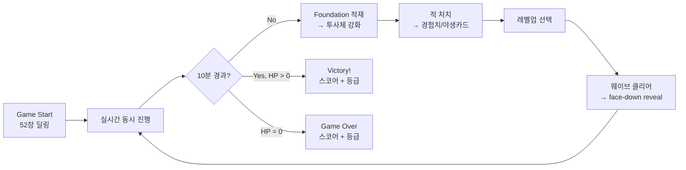
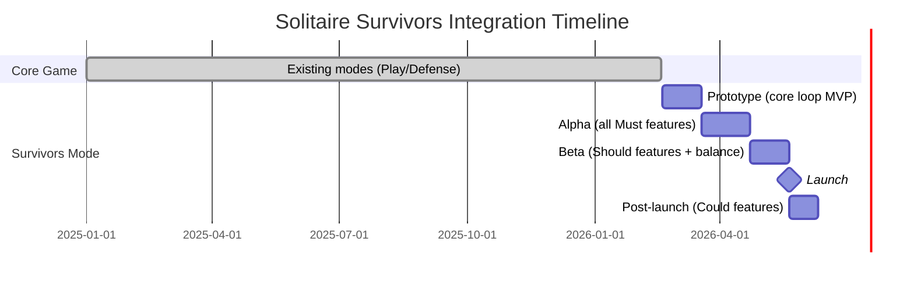

# PRD: Solitaire Survivors Mode

## 1. Executive Summary

**Mode Name**: Solitaire Survivors
**Genre Tags**: Solitaire + Survivors-like, Real-time Action Card Game
**Base Game**: Solitary -- Klondike Solitaire with AI Solver

### Key Differentiators (vs Core Solitaire)
1. **Foundation-as-Arsenal**: Foundation에 카드를 올릴 때마다 투사체가 즉시 발사되고 영구적으로 강화되며, 솔리테어 진행이 곧 전투력 증가로 이어진다.
2. **Real-time Simultaneous Play**: 턴제가 아닌 실시간 동시 진행. 플레이어는 하단에서 솔리테어를 플레이하는 동안 상단에서 자동 전투가 계속되며, 멈추지 않는 긴장감을 제공한다.
3. **Positive Feedback Loop**: 솔리테어 진행 → 전투력 상승 → 적 처치 → 야생카드 획득 → 솔리테어 돌파구 제공이라는 양방향 긍정적 상승 나선 구조.

### Concept
Solitaire Survivors는 클론다이크 솔리테어 메카닉과 Vampire Survivors 스타일 실시간 생존 액션을 융합한다. 플레이어 캐릭터는 화면 중앙에 고정되어 사방에서 접근하는 적을 자동 투사체로 공격하며, 플레이어는 하단의 솔리테어를 조작하여 투사체를 강화한다. 10분간 10개 웨이브를 생존하는 것이 목표이며, 솔리테어를 잘 풀수록 전투가 강해지고, 전투를 잘할수록 솔리테어 진행이 쉬워진다.

---

## 2. Mode Vision & Goals

### Value Proposition
기존 솔리테어는 정적인 퍼즐 경험을 제공하지만 장기적 몰입도가 낮다. Solitaire Survivors는 "멈추지 않는 실시간 전투"라는 외부 압박을 추가하여 솔리테어의 모든 선택에 전술적 무게를 부여한다. 동시에 Survivors-like 장르의 자동 성장 쾌감과 레벨업 선택의 전략성을 제공하여, 액션 게임 플레이어와 퍼즐 게임 플레이어 모두를 만족시킨다.

### Success Criteria
| Metric | Target | Measurement |
|--------|--------|-------------|
| Mode adoption rate | > 40% of active users try within 7 days | Analytics |
| Mode session share | > 25% of total sessions | Analytics |
| Mode D7 retention | > 35% | Cohort |
| Cross-mode engagement | 70% play both modes weekly | Analytics |
| Avg session length | 10-15 min (survivors), vs 5-10 min (core) | Analytics |
| Session completion rate | > 25% (10분 생존 완료) | Analytics |

---

## 3. Target Players & Personas

### Persona: Action Seeker Alex
- **Profile**: Midcore
- **Relationship to Core Solitaire**: Occasional player, prefers action games
- **Play Sessions**: 15-30 min sessions, evening gaming
- **Motivations**: Vampire Survivors 팬으로 빌드 최적화와 레벨업 선택의 전략성을 즐김. "솔리테어를 액션 게임으로 만든다"는 컨셉에 흥미
- **Pain Points**: 순수 솔리테어는 너무 느리고 정적. 전통 VS 게임은 이동 조작이 번거로움

### Persona: Hybrid Hannah
- **Profile**: Casual
- **Relationship to Core Solitaire**: Regular player, 2-3 sessions/week
- **Play Sessions**: 10-20 min sessions, lunch breaks
- **Motivations**: 솔리테어의 익숙함 + 새로운 도전. "내가 아는 규칙으로 새 경험"을 원함
- **Pain Points**: 솔리테어가 막히면 답답함. 액션 게임은 조작이 복잡해서 부담

### Persona: Completionist Chris
- **Profile**: Hardcore
- **Relationship to Core Solitaire**: Expert player, solver 이해
- **Play Sessions**: 30-60 min focused sessions
- **Motivations**: S-rank 달성, Full Suit 완성, 듀얼 콤보 해금 등 마일스톤 추적. 빌드 최적화 실험
- **Pain Points**: 기존 솔리테어는 변수가 적어 금방 지루함. 더 복잡한 전략을 원함

---

## 4. Core Loop & Session Design

### Core Loop Diagram



### Solitaire Intersection Points
- **실시간 진행** 중 표준 Klondike 규칙 100% 적용 (reuses `SolitaireCore`, `SolitaireState`)
- Foundation 적재 시 즉시 2가지 효과: (1) 투사체 1발 발사 (2) 해당 Suit 투사체 Tier 영구 상승
- 전투와 솔리테어가 **동시에 진행**되며 서로 영향을 주고받음

### Session Comparison
| Aspect | Core Solitaire | Solitaire Survivors |
|--------|---------------|---------------------|
| Session Length | 3-10 min | 10-15 min |
| Win Condition | All 52 cards to foundation | Survive 10 minutes (10 waves) |
| Fail Condition | No moves available | Player HP reaches 0 |
| Replayability | Seed-based | Seed + wave randomization + levelup choices |
| Scoring | Win/Lose binary | Multi-factor score (S/A/B/C/D ranking) |
| Pacing | Turn-based, contemplative | Real-time, intense |

### FTUE (First Time User Experience)
1. **Discovery**: "Survivors Mode" button on main menu (`/`), tagline: "Real-time solitaire action - survive 10 minutes!"
2. **Tutorial Wave (Wave 1)**: 간단한 오버레이 안내: "Foundation에 카드를 올려 투사체를 강화하세요. 적의 약점 마크를 확인하세요!"
3. **First Success Moment**: Wave 1 클리어(1분) → face-down 카드 1장 자동 reveal + "WAVE CLEARED!" 피드백
4. **Unguided Play**: Wave 2부터는 안내 없이 자율 플레이. 레벨업 선택지가 자연스럽게 시스템 학습 유도

---

## 5. Shared Infrastructure

### Reuse Matrix
| Component | File | Reuse Strategy |
|-----------|------|---------------|
| GameBridge | `game/bridge/GameBridge.ts` | Extend (add survivors callbacks) |
| CardSprite | `game/objects/CardSprite.ts` | Reuse as-is |
| CardRenderer | `game/rendering/CardRenderer.ts` | Reuse as-is (same textures) |
| LayoutManager | `game/rendering/LayoutManager.ts` | New instance (survivors layout config) |
| SpriteManager | `game/sprites/SpriteManager.ts` | Extend (add survivors sprite pools) |
| InteractionController | `game/interaction/InteractionController.ts` | Reuse (standard solitaire drag-drop) |
| ThemeManager | `game/rendering/ThemeManager.ts` | Reuse as-is |
| SolitaireCore | `game/core/SolitaireCore.ts` | Wrap (survivors events on Foundation moves) |
| SolitaireState | `solver/SolitaireState.ts` | Reference (solitaire sub-state) |
| NestedRolloutSolver | `solver/NestedRolloutSolver.ts` | Reuse (hint system) |
| Deck | `solver/Deck.ts` | Reuse (seeded shuffle) |
| CardMovementRunner | `game/movement/CardMovementRunner.ts` | Reuse (card animations) |
| AnimationManager | `game/rendering/AnimationManager.ts` | Reuse (card move animations) |
| PileZone | `game/objects/PileZone.ts` | Reuse (tableau/foundation zones) |
| Types | `solver/types.ts` | Reuse (Card, Suit, Move, ActionType) |

### Solitaire Core Reference
- **Rules reused as-is**: Tableau stacking (descending, alternating color), Foundation building (ascending, same suit), Stock draw (3 cards), Waste cycling, Partial stack moves
- **Rules unchanged**: No Klondike rules are modified
- **Mode-specific additions**: Real-time battle overlay, Foundation-to-projectile conversion events, Wild card system

---

## 6. Feature Requirements (MoSCoW)

| Priority | Feature | New / Reuse | GDD Source | Acceptance Criteria |
|----------|---------|-------------|------------|---------------------|
| **Must** | Real-time simultaneous play | New | `[GDD: 01-core-loop]` | Solitaire and battle both active; no phase transitions; time continues |
| **Must** | Foundation-to-Projectile conversion | New | `[GDD: 01-core-loop, 02-projectile-system]` | Each card placed on Foundation fires 1 instant projectile + permanently increases projectile count for that Suit |
| **Must** | 4 Projectile Types (Slash/Holy Orb/Arrow/Fireball) | New | `[GDD: 02-projectile-system]` | Each Suit maps to distinct projectile with unique behavior per GDD table |
| **Must** | Projectile count scaling | New | `[GDD: 02-projectile-system]` | Count = `ceil(Foundation Rank / 3)`, min 1 max 5 |
| **Must** | Player character (fixed position) | New | `[GDD: 01-core-loop]` | Character fixed at center, HP system, invincibility frames on hit |
| **Must** | 360-degree enemy spawning | New | `[GDD: 03-enemy-and-wave]` | Enemies spawn from all edges, move toward player, contact damage |
| **Must** | 10-minute 10-wave structure | New | `[GDD: 03-enemy-and-wave]` | Each wave = 1 minute, difficulty scaling per GDD table |
| **Must** | 6 Enemy types (Grunt/Runner/Shield/Ranger/Healer/Siege) | New | `[GDD: 03-enemy-and-wave]` | Each type has correct stats and behavior per GDD |
| **Must** | Enemy weakness system | New | `[GDD: 03-enemy-and-wave]` | Each enemy shows 1 Suit weakness icon; weakness = x2.0 damage |
| **Must** | Wild card drop system | New | `[GDD: 04-feedback-and-safety]` | 15% drop rate on enemy kill; 3 types: Joker(7%), Peek(5%), Bomb(3%) |
| **Must** | Levelup system | New | `[GDD: 03-enemy-and-wave]` | XP from kills + face-down flips; 3 levelups at Wave 3/6/9; 3-choice UI |
| **Must** | SurvivorsScene (Phaser) | New | `[GDD: 05-ui-and-integration]` | New scene with split layout: battle top 55%, solitaire bottom 35% |
| **Must** | `/survivors` route | New | `[GDD: 05-ui-and-integration]` | Next.js page at `/survivors` loads SurvivorsScene |
| **Should** | Combo timer system | New | `[GDD: 02-projectile-system]` | 10-second window for consecutive Foundation placement; 1x → 1.3x → 1.6x → 2.0x damage scaling |
| **Should** | Rank bonus damage | New | `[GDD: 02-projectile-system]` | Rank 10-K grants x1.3 damage multiplier |
| **Should** | Full Suit (K completion) special effects | New | `[GDD: 02-projectile-system]` | K completion grants permanent projectile upgrade per Suit per GDD |
| **Should** | Dual combos (Red/Black/Royal) | New | `[GDD: 02-projectile-system]` | 2-Suit and 4-Suit Tier threshold combos with fusion projectiles |
| **Should** | Chain gauge system | New | `[GDD: 04-feedback-and-safety]` | Tableau-to-Tableau moves charge gauge; 100% = 3s firing speed x2 burst |
| **Should** | Barrier zones (empty Tableau columns) | New | `[GDD: 04-feedback-and-safety]` | Empty columns create slow zones in corresponding battle areas (50% speed reduction) |
| **Should** | Wave clear reward | New | `[GDD: 04-feedback-and-safety]` | Auto-reveal 1 face-down card per wave cleared |
| **Should** | 2 Minibosses (Brute/Shadow) | New | `[GDD: 03-enemy-and-wave]` | Wave 4 and 7 minibosses with special mechanics and guaranteed wild card drop |
| **Should** | Final boss (King of Ruin) | New | `[GDD: 03-enemy-and-wave]` | Wave 10 boss with 3-phase fight, Suit weakness rotation |
| **Should** | Scoring system with S/A/B/C/D ranks | New | `[GDD: 03-enemy-and-wave]` | Score from multiple factors: time, kills, foundation progress, combos |
| **Could** | Bomb dual-use mechanic | New | `[GDD: 04-feedback-and-safety]` | Foundation placement = screen explosion; Tableau placement = flip 2 face-down |
| **Could** | Stock cycling slow effect | New | `[GDD: 04-feedback-and-safety]` | Stock draw triggers 0.5s enemy slow (30%) |
| **Could** | New deck dealing option | New | `[GDD: 04-feedback-and-safety]` | After 52-card completion, option to deal new deck while keeping Foundation |
| **Could** | Mobile-optimized layout | New | `[GDD: 05-ui-and-integration]` | On <768px, swipe to toggle between battle fullscreen and solitaire fullscreen |
| **Could** | Battle speed control | New | `[GDD: 05-ui-and-integration]` | Speed multiplier (x1, x2, x4) applied to battle tick rate |
| **Won't** | Tableau cursed zones (boss penalty) | -- | `[GDD: 06-debate-log]` | Rejected: negative feedback creates downward spiral |
| **Won't** | Hit → Foundation delay penalty | -- | `[GDD: 06-debate-log]` | Rejected: learned helplessness risk |
| **Won't** | Fixed Suit resistance waves | -- | `[GDD: 06-debate-log]` | Rejected: contradicts Klondike rules (no Suit priority control) |
| **Won't** | Meta progression (hero unlocks, permanent upgrades) | -- | `[GDD: 06-debate-log]` | Deferred to v2: core loop validation first |

---

## 7. Non-Functional Requirements

### Performance
| Requirement | Target | Measurement |
|-------------|--------|-------------|
| Frame rate | 60 FPS minimum | Chrome DevTools |
| Max concurrent enemies | 30 on screen | Performance profiling |
| Max concurrent projectiles | 20 per Suit (80 total) | Object pooling validation |
| Battle computation | < 16ms per frame | Performance markers |
| Card animation | Same as core solitaire | Existing benchmarks |

### Compatibility
| Platform | Support Level | Notes |
|----------|--------------|-------|
| Desktop Chrome/Edge | Full support | Primary target |
| Desktop Firefox/Safari | Full support | Secondary target |
| Tablet (768px+) | Full support | Same layout, scaled |
| Mobile (<768px) | Phase-toggle mode | Swipe to switch battle/solitaire views |

### Accessibility
- Colorblind mode: Suit symbols + color (not color alone)
- Large text mode: HUD font 120% scaling
- High contrast mode: Background/foreground brightness separation

---

## 8. UI/UX Requirements

### Screen Layout (Desktop)

```
┌─────────────────────────────────────────────────────┐
│  [Time/Wave]     [Score]         [HP]  [Settings]   │ <- HUD (5%)
├─────────────────────────────────────────────────────┤
│                                                     │
│              Battle View (55%)                      │
│                                                     │
│    Enemy  Enemy         [Player]        Enemy      │
│                        (Fixed)                      │
│                                                     │
│  [♠️x3] [♥️x2] [♦️x1] [♣️x0]  <- Projectile counts   │
├─────────────────────────────────────────────────────┤
│ [Chain ████████░░] [🃏][👁️][💣]  <- Middle bar (5%)  │
├─────────────────────────────────────────────────────┤
│                                                     │
│          Solitaire View (35%)                       │
│                                                     │
│    [F♠️] [F♥️] [F♦️] [F♣️]      [Stock] [Waste]      │
│  [T1] [T2] [T3] [T4] [T5] [T6] [T7]                │
│                                                     │
└─────────────────────────────────────────────────────┘
```

### HUD Elements
- **Top bar**: Time/Wave (left), Score (center-left), HP bar (center-right), Settings (right)
- **Battle view**: 2D arena with player fixed center, enemies from all edges, projectile effects
- **Middle bar**: Chain gauge (left), Wild card slots x3 (right)
- **Solitaire view**: Standard Klondike layout with Foundation feedback effects

### Visual Feedback Requirements
| Action | Visual Effect | Audio | Timing |
|--------|--------------|-------|--------|
| Foundation placement | Suit-color particle + instant projectile fire + enemy knockback | Card place + projectile launch | < 0.1s |
| Tableau move | Chain gauge fill animation | Soft chime | Immediate |
| Enemy kill | Score popup + XP bar + wild card drop (15%) | Impact sound | Immediate |
| Wave clear | "WAVE X CLEAR" text + face-down auto-reveal glow | Fanfare | 3s display |
| Levelup | Slow-motion (0.2x) + 3-card choice UI center screen | Level-up jingle | Until choice |
| Full Suit (K) | Screen flash in Suit color + ultimate ability activation | Epic sound | 2s effect |

### Suit Color Consistency
- **Spade**: Purple (#9B59B6)
- **Heart**: Red (#E74C3C)
- **Diamond**: Blue (#3498DB)
- **Club**: Green (#2ECC71)

These colors apply to: projectiles, Foundation piles, middle bar icons, enemy weakness icons.

---

## 9. Technical Constraints

### Architecture
1. **Scene Isolation**: SurvivorsScene completely independent from TableScene and DefenseScene
2. **SolitaireState Wrapper**: Wrap (not modify) existing SolitaireState to hook Foundation events
3. **GameBridge Extension**: Add survivors-specific callbacks without breaking existing modes
4. **State Serialization**: SurvivorsState must be JSON-serializable for potential save/load
5. **Performance Budget**: 60 FPS with max 30 enemies + 80 projectiles on screen

### Integration Points
```
React (UI)
  └─> GameBridge (extended with survivors callbacks)
       └─> SurvivorsScene (Phaser)
            ├─> SolitaireWrapper (bottom 35%)
            │    └─> onFoundation → ProjectileSystem
            │    └─> onTableauMove → ChainGaugeSystem
            │
            └─> BattleEngine (top 55%)
                 └─> onEnemyKilled → WildCardManager + XP
                 └─> onPlayerHit → React (HP update)
```

### File Structure (New Modules)
```
web/src/game/survivors/
  SurvivorsScene.ts              # Main Phaser scene
  SurvivorsBattleEngine.ts       # 2D combat calculation
  ProjectileSystem.ts            # Projectile manager (Suit-based)
  WildCardManager.ts             # Wild card drop/storage/use
  ChainGaugeSystem.ts            # Chain gauge charge/burst
  LevelUpSystem.ts               # XP + levelup choices
  ComboTimerSystem.ts            # Combo timer + damage scaling
  WeaknessSystem.ts              # Enemy weakness assignment/display
  PlayerCharacter.ts             # Player sprite (fixed, HP, knockback)
  EnemySprite.ts                 # Enemy sprite (2D movement, weakness icon)
  ProjectileSprite.ts            # Projectile sprite (Suit-specific visuals)
  BarrierZoneRenderer.ts         # Barrier zone rendering (empty columns)
  SurvivorsState.ts              # Survivors game state
```

---

## 10. Acceptance Criteria

### Must Criteria (Blocking Release)
1. **Core Loop Functional**: 10-minute session playable from start to victory/defeat
2. **Zero Klondike Rule Changes**: Standard solitaire rules 100% preserved
3. **Foundation → Projectile Link**: Immediate feedback (< 0.1s) on card placement
4. **Wild Card Safety Net**: Joker/Peek/Bomb drop and use correctly
5. **Performance**: 60 FPS maintained with 20+ enemies on screen
6. **Levelup System**: 3 levelups occur at Wave 3/6/9 with 3-choice UI
7. **Wave Progression**: 10 waves with escalating difficulty per GDD table
8. **Victory/Defeat**: Correct win/loss conditions and score screen

### Should Criteria (Quality Targets)
1. **Visual Polish**: All projectile types have distinct Suit-colored effects
2. **Audio Feedback**: Sound effects for Foundation placement, kills, levelup
3. **Combo System**: Combo timer and dual combos (Red/Black/Royal) functional
4. **Miniboss/Boss**: 2 minibosses + final boss with special mechanics
5. **Mobile Support**: Phase-toggle layout works on < 768px screens

### Could Criteria (Nice to Have)
1. **Battle Speed Control**: x1/x2/x4 speed options
2. **New Deck Dealing**: Option to deal new deck after 52-card completion
3. **Advanced Levelup Options**: All 3 categories with 5+ choices each

---

## 11. Out of Scope (v1)

| Feature | Reason | Future Consideration |
|---------|--------|---------------------|
| Meta progression (hero unlocks, permanent upgrades) | Core loop validation first | v2 feature |
| Endless mode (post-10-minute) | Session length already at upper limit | v2 feature |
| Multiplayer / co-op | Technical complexity too high | Not planned |
| Custom difficulty levels | Balancing burden for v1 | v2 feature |
| Leaderboard / daily seeds | Infrastructure not in place | v2 feature |
| Achievements / badges | Meta system required | v2 feature |
| Alternative game modes (5-wave quick mode) | Scope creep | v2 feature |

---

## 12. Risk & Mitigation

| # | Risk | Category | Prob. | Impact | Mitigation |
|---|------|----------|-------|--------|------------|
| R1 | Multitasking cognitive overload (battle + solitaire) | UX | High | High | Simplify battle (auto-targeting, fixed player); passive feedback channels (auto-reveal, barrier zones) |
| R2 | Solitaire blocking frustration (bad deal) | Gameplay | High | High | 4-layer safety net: Stock cycling, levelup aids, wave reveals, wild cards (15% drop rate) |
| R3 | Performance regression with 30+ entities | Tech | Med | High | Object pooling, particle limits, 60 FPS budget enforcement |
| R4 | Session length too long for casual players | Product | Med | Med | Target 10-min design; provide early success moments (Wave 1-3); allow mid-session quit with partial score |
| R5 | Combo timer adds unwanted pressure | UX | Med | Med | 10-second window (generous); combo is bonus not requirement; base gameplay works without it |
| R6 | Wild card drop RNG creates unfairness | Balance | Med | Med | 15% total drop rate tuned via playtesting; miniboss guaranteed drops; levelup "Solitaire Aid" as fallback |
| R7 | Survivors mode cannibalizes Defense mode | Product | Low | Med | Different player personas (Action Seeker vs Strategy Steve); track cross-mode engagement |
| R8 | SolitaireState wrapper breaks existing modes | Tech | Low | High | Comprehensive regression testing on `/play` and `/defense` after integration |

---

## 13. Success Metrics & KPIs

### Mode-Specific KPIs
| KPI | Formula | Target |
|-----|---------|--------|
| Mode Entry Rate | Survivors sessions / Total sessions | > 25% |
| Wave 5 Reach Rate | Games reaching Wave 5 / Games started | > 60% |
| Session Completion Rate | 10-minute completes / Games started | > 25% |
| Mode Win Rate | Wave 10 clears / Games started | > 20% |
| Avg Session Length | Total survivors time / Survivors sessions | 10-15 min |
| Cross-Mode Ratio | Users playing both modes / Total users | > 70% |
| S-Rank Rate | S-rank games / Wave 10 clears | ~3% |

### Impact on Existing KPIs
| Existing KPI | Expected Impact | Monitoring Plan |
|-------------|----------------|-----------------|
| Overall D1 Retention | +8-12% (new content hook) | Pre/post comparison |
| Total Session Count | +0.6 sessions/user/day | Segmented analysis |
| Avg Session Length | Increase (survivors sessions longer) | Mode-segmented tracking |
| Core Solitaire Usage | Stable or slight decrease | Monitor for >15% drop |

---

## 14. Competitive Reference

| Game | Mode/Feature | Similarity | Our Advantage |
|------|-------------|-----------|---------------|
| Vampire Survivors | Auto-attacking projectiles, levelup choices | Real-time survival + upgrade selection | Our resource acquisition is skill-based (solitaire) not passive; fixed player position reduces control complexity |
| Brotato | Fixed-position auto-battler | Stationary combat with projectile variety | Our meta-layer is solitaire (familiar, strategic) not shop/economy RNG |
| Solitairica | Solitaire + RPG combat | Card mechanics power combat | We preserve full Klondike rules; combat is spatial/real-time not turn-based |
| 20 Minutes Till Dawn | Survivors-like with build variety | Projectile customization via upgrades | Our upgrades tied to Foundation progress (solitaire skill) creates unique dual-task gameplay |

---

## 15. Release Plan

### Integration Timeline



### Milestone Table
| Phase | Duration | Deliverables | Gate Criteria |
|-------|----------|-------------|---------------|
| Prototype | 4 weeks | SurvivorsScene boots; real-time solitaire + battle functional; 3 enemy types; basic projectile system | Internal playtest: core loop feels cohesive; no Klondike rule violations |
| Alpha | 5 weeks | All Must features; 6 enemy types; 10 waves; levelup system; wild cards; scoring | Feature complete; all Must acceptance criteria pass; 60 FPS on target hardware |
| Beta | 4 weeks | Should features (combo timer, dual combos, minibosses, boss, chain gauge); balance tuning; visual polish | Wave 5 reach > 60%; session completion > 20%; zero P0 bugs |
| Launch | -- | Public release at `/survivors`; analytics live | KPI targets met; zero P0/P1 bugs; cross-browser compatibility verified |
| Post-launch | 3 weeks | Could features (Bomb dual-use, new deck option, speed control, mobile optimization) | Adoption rate > 40% within 14 days; D7 retention > 30% |

---

## 16. Appendix

### GDD Cross-Reference Table
| PRD Section | GDD Document | GDD Section |
|-------------|-------------|-------------|
| Core Loop & Session | `01-core-loop.md` | 실시간 동시 진행, 양방향 피드백, 승리/패배 조건 |
| Feature: Projectiles | `02-projectile-system.md` | Suit 매핑, 투사체 수 공식, 콤보 타이머, K 완성 특수효과 |
| Feature: Enemies/Waves | `03-enemy-and-wave.md` | 적 타입, 스폰 메커니즘, 약점 시스템, 10 웨이브 구조, 보스 |
| Feature: Feedback/Safety | `04-feedback-and-safety.md` | 양방향 피드백 채널, 야생카드, 4중 안전장치, 체인 게이지 |
| Feature: UI/Layout | `05-ui-and-integration.md` | 화면 구조, HUD, 레벨업 UI, 기존 코드베이스 통합 |
| Design Decisions | `06-debate-log.md` | 토론 과정, 합의/불채택 항목, Classic vs Creative 비교 |

### Glossary
| Term | Definition |
|------|-----------|
| Core Solitaire | The existing Klondike solitaire mode in Solitary (`/play`) |
| Defense Mode | The existing Solitaire Defense game mode (`/defense`) |
| Survivors Mode | The new Solitaire Survivors game mode (`/survivors`) |
| Foundation | Standard Klondike foundation piles; in Survivors Mode, also the projectile production mechanism |
| Projectile Tier | Foundation 최고 Rank에 따른 투사체 수 (0-5발) |
| Wild Card | 적 처치 시 드랍되는 특수 카드 (Joker/Peek/Bomb) |
| Combo Timer | 같은 Suit에 10초 내 연속 적재 시 데미지 배율 증가 (최대 x2.0) |
| Chain Gauge | Tableau 이동으로 충전되는 게이지; 100% 시 3초간 발사속도 x2 버스트 |
| Dual Combo | 2개 이상 Suit가 특정 Tier 조건 충족 시 발동되는 융합 투사체 (Red/Black/Royal) |
| Barrier Zone | 빈 Tableau 열에 대응하는 전투 영역의 적 감속 존 (50% slow) |
| Suit Weakness | 각 적에게 부여된 1개 Suit 약점 (해당 Suit 투사체 데미지 x2.0) |
| GameBridge | React-to-Phaser communication singleton (`game/bridge/GameBridge.ts`) |
| SolitaireState | Pure game logic class for Klondike rules (`solver/SolitaireState.ts`) |

### Scoring System Detail

**점수 항목**:
- 생존 시간: 초당 1점 (최대 600점)
- 일반 적 처치: 적당 10점
- 미니보스 처치: 보스당 50점 (최대 100점)
- 최종 보스 처치: 500점
- Foundation 카드: 카드당 20점 (최대 1040점)
- Suit 콤보: 콤보당 25점
- 듀얼 콤보 해금: 콤보당 100점 (최대 300점)
- Full Suit 완성: Suit당 200점 (최대 800점)
- 잔여 HP: HP 1당 5점 (최대 500점)
- 솔리테어 완성: 1000점

**등급 기준**:
- S: 5000+
- A: 3500+
- B: 2000+
- C: 1000+
- D: ~999

---

## 17. 구현 우선순위 Summary

### Phase 1: 핵심 루프 (MVP)
1. SurvivorsScene 골격 (상하 분할 레이아웃)
2. SolitaireWrapper + Foundation 이벤트 후킹
3. ProjectileSystem (기본 발사, Suit별 4종)
4. BattleEngine (2D 적 이동 + 충돌 + HP)
5. 기본 HUD (HP, 시간, 점수, 웨이브)

### Phase 2: 전투 시스템
1. 적 약점 시스템 (아이콘 표시 + x2.0 데미지)
2. 투사체 Tier 스케일링 (ceil(Rank/3) 공식)
3. Wild card 드랍 (Joker 우선, Peek/Bomb은 Phase 3)
4. 레벨업 시스템 (XP + 3-choice UI)

### Phase 3: 피드백 루프
1. 콤보 타이머 (10초 윈도우, x1.0 → x2.0)
2. 체인 게이지 (Tableau 이동 → 100% → 발사속도 x2 버스트)
3. 웨이브 클리어 보상 (face-down 1장 자동 reveal)
4. Peek/Bomb wild card 구현

### Phase 4: 진행도 시스템
1. 듀얼 콤보 (Red/Black/Royal)
2. Full Suit (K) 특수 효과
3. 미니보스 2종 (Brute/Shadow)
4. 최종 보스 (King of Ruin, 3-phase)

### Phase 5: 폴리시
1. 파티클 이펙트 (모든 Suit 색상)
2. 사운드 이펙트 (카드 적재, 적 처치, 레벨업)
3. 결계 존 렌더링 (빈 열 → 감속 영역)
4. 게임 오버/승리 화면 (스코어 집계 + 등급)

---

## Summary

Solitaire Survivors는 "실시간 동시 진행"과 "양방향 긍정 피드백"이라는 두 축으로 Klondike 솔리테어와 Survivors-like 액션을 융합한다. 플레이어는 하단에서 표준 솔리테어 규칙으로 카드를 조작하며, Foundation 적재가 상단 전투의 투사체 강화로 즉시 반영된다. 역방향으로 적 처치 시 야생카드가 드랍되어 막힌 솔리테어를 돌파하는 구조를 만든다.

4중 안전장치(Stock 무한 순환, 레벨업 보조, 웨이브 reveal, 야생카드)는 Klondike의 본질적 막힘 문제를 완화하되, 규칙 자체는 일체 변경하지 않는다. 부정적 역방향 피드백(저주, 패널티)은 모두 배제하여 "약해질수록 더 약해지는" 하향 나선을 방지한다.

기존 Defense 모드와의 차별점: (1) 턴제 → 실시간 전환, (2) 유닛 소환 → 투사체 강화, (3) 단방향 → 양방향 피드백, (4) 1D 레인 → 2D 아레나. 목표는 10분 내내 "다음 수가 있다"는 느낌을 유지하며 85-90% 완주율을 달성하는 것이다.
