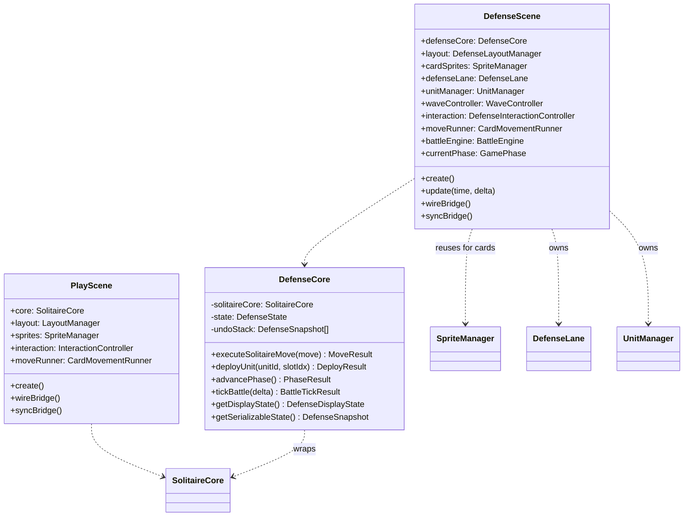
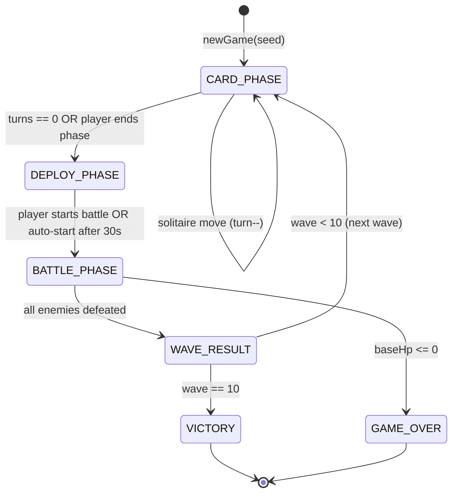

# TRD: Solitaire Defense Mode

## 1. Technical Overview

### System Summary
This TRD defines the technical architecture for **Solitaire Defense**, a new game mode added to the Solitary project. It introduces:

- **New**: `DefenseScene.ts`, `DefenseCore.ts`, `DefenseState.ts`, `BattleEngine.ts`, `WaveController.ts`, `UnitManager.ts`, `UnitSprite.ts`, `EnemySprite.ts`, `DefenseLane.ts`
- **Extended**: `GameBridge` (defense callbacks), `LayoutManager` (split-screen config), `SpriteManager` (defense sprite arrays)
- **Reused as-is**: `CardSprite`, `CardRenderer`, `ThemeManager`, `Deck`, `PileZone`, `CardMovementRunner`, solver types (`Card`, `Suit`, `Move`, `ActionType`)

### Architecture Principles
1. **Scene isolation**: Defense mode runs in its own `DefenseScene`, not modifying `PlayScene` or `SimulateScene`
2. **Bridge pattern compliance**: All React <-> Phaser communication via `GameBridge` extended with defense-specific callbacks
3. **Core/Scene separation**: Pure game logic in `DefenseCore`, rendering and animation in `DefenseScene`
4. **Composition over inheritance**: `DefenseCore` wraps `SolitaireCore` via composition, never subclasses it
5. **State serialization**: All defense state is JSON-serializable for future save/load support

### Technical Constraints
- Runtime: Browser (Chrome 90+, Safari 15+, Mobile browsers)
- Framework: Phaser 3.80+ (WebGL with Canvas fallback)
- Language: TypeScript 5.x (strict mode)
- Bundle: Next.js 16 (tree-shaking, dynamic imports for defense module)
- No native dependencies (pure browser APIs)
- Battle computations on main thread (complexity is low; Web Worker reserved for Solver only)

---

## 2. Scene Architecture

### Scene Class Diagram



### Scene Lifecycle

1. **preload**: No-op (textures generated in create via `CardRenderer`; defense sprites use programmatic rendering)
2. **create**:
   - Initialize `DefenseCore` (creates internal `SolitaireCore` with seed)
   - Create `DefenseLayoutManager` with split-screen dimensions
   - Generate card textures via `CardRenderer.generateTextures()`
   - Build card sprites from initial solitaire state (reuse `SpriteManager` pattern)
   - Create defense lane visuals (`DefenseLane`)
   - Create HUD elements (wave info, turn counter, score, base HP bar)
   - Wire bridge callbacks
   - Sync initial state to React
   - Set phase to `CARD_PHASE`
3. **update(time, delta)**:
   - If `BATTLE_PHASE`: tick `BattleEngine` with `delta * speedMultiplier`
   - If `CARD_PHASE`: update turn counter display
   - Update all sprite positions/animations
4. **shutdown**: Clear bridge callbacks, destroy all sprites, nullify references

### Scene Transition Strategy

**Route-based (recommended)**:
- `/play` -> `PlayScene` (existing)
- `/defense` -> `DefenseScene` (new route + page component)
- `/simulate` -> `SimulateScene` (existing)
- Each route creates its own `Phaser.Game` instance via `PhaserGameInner`

This matches the existing pattern where `/play` and `/simulate` are independent routes with separate Phaser instances.

---

## 3. Game State & Core Logic

### State Interfaces

```typescript
// game/defense/DefenseState.ts

interface DefenseState {
  /** Current game phase */
  phase: GamePhase;

  /** Current wave number (1-10) */
  wave: number;

  /** Remaining turns in current Card Phase */
  turnsRemaining: number;

  /** Base HP (0-200) */
  baseHp: number;

  /** Cumulative score */
  score: number;

  /** Units available for deployment (produced from Foundation) */
  unitPool: UnitData[];

  /** Carried-over units from previous wave (max 5) */
  carryOverUnits: UnitData[];

  /** Defense lane slots (5 slots, null = empty) */
  laneSlots: (DeployedUnit | null)[];

  /** Active enemies in current battle */
  enemies: EnemyData[];

  /** Suit combo tracker (current consecutive suit, count) */
  comboState: { suit: Suit | null; count: number };

  /** Achieved milestones */
  milestones: Set<MilestoneType>;

  /** Foundation card counts per suit (for milestone tracking) */
  foundationTopRank: [number, number, number, number]; // H, D, C, S

  /** Suit affinity for current wave (null = no affinity) */
  waveAffinity: { resistant: Suit[]; weak: Suit[] } | null;

  /** Seed for reproducibility */
  seed: number;

  /** Total moves executed across all waves */
  moveCount: number;
}

enum GamePhase {
  CARD_PHASE = 'card_phase',
  DEPLOY_PHASE = 'deploy_phase',
  BATTLE_PHASE = 'battle_phase',
  WAVE_RESULT = 'wave_result',
  VICTORY = 'victory',
  GAME_OVER = 'game_over',
}

interface UnitData {
  id: string;
  class: UnitClass;    // KNIGHT | CLERIC | ARCHER | MAGE
  grade: UnitGrade;    // BRONZE | SILVER | GOLD | CHAMPION
  baseHp: number;
  baseAtk: number;
  spd: number;
  range: number;
  comboBonusAtk: number;   // from suit combo
  comboBonusHp: number;    // from suit combo
  sourceCard: { rank: number; suit: Suit };
}

enum UnitClass { KNIGHT = 0, CLERIC = 1, ARCHER = 2, MAGE = 3 }
enum UnitGrade { BRONZE = 0, SILVER = 1, GOLD = 2, CHAMPION = 3 }

interface DeployedUnit extends UnitData {
  slotIndex: number;
  currentHp: number;
  isAlive: boolean;
}

interface EnemyData {
  id: string;
  type: EnemyType;
  hp: number;
  maxHp: number;
  atk: number;
  spd: number;
  position: number;     // x-position on lane (0 = base, 1 = rightmost)
  isBoss: boolean;
  resistSuits: Suit[];
  weakSuits: Suit[];
}

enum EnemyType { GRUNT = 0, RUNNER = 1, SHIELD = 2, HEALER = 3, SIEGE = 4, BRUTE = 5, SHADOW = 6, KING_OF_RUIN = 7 }

enum MilestoneType {
  FIRST_BLOOD = 'first_blood',
  SQUAD_READY = 'squad_ready',
  SILVER_GATE = 'silver_gate',
  GOLD_GATE = 'gold_gate',
  FULL_SUIT = 'full_suit',
}
```

### State Machine



### Core Class: DefenseCore

```typescript
// game/defense/DefenseCore.ts

class DefenseCore {
  private state: DefenseState;
  private solitaireCore: SolitaireCore;  // composition, not inheritance
  private undoStack: DefenseSnapshot[];
  private emitter: Phaser.Events.EventEmitter;

  constructor(seed: number) {
    this.solitaireCore = new SolitaireCore(seed);
    this.state = this.createInitialState(seed);
    this.undoStack = [];
    this.emitter = new Phaser.Events.EventEmitter();
  }

  /** Delegate solitaire move, decrement turns, check Foundation events */
  executeSolitaireMove(move: Move): MoveResult {
    const beforeFoundation = [...this.state.foundationTopRank];
    const result = this.solitaireCore.executeMove(move);
    this.state.turnsRemaining--;
    this.state.moveCount++;

    // Detect new Foundation cards
    const afterFoundation = this.getFoundationTopRanks();
    this.detectFoundationChanges(beforeFoundation, afterFoundation, move);

    if (this.state.turnsRemaining <= 0) {
      this.advancePhase(); // auto-transition to DEPLOY_PHASE
    }

    this.emitter.emit('stateChanged', this.getDisplayState());
    return result;
  }

  /** Execute Stock draw (also costs a turn) */
  executeStockDraw(): StockDrawResult {
    const result = this.solitaireCore.drawStock();
    this.state.turnsRemaining--;
    this.state.moveCount++;

    if (this.state.turnsRemaining <= 0) {
      this.advancePhase();
    }

    this.emitter.emit('stateChanged', this.getDisplayState());
    return result;
  }

  /** Place a unit from pool onto a lane slot */
  deployUnit(unitId: string, slotIndex: number): DeployResult { ... }

  /** Advance to next phase */
  advancePhase(): void { ... }

  /** Tick battle simulation (called from scene update loop) */
  tickBattle(delta: number): BattleTickResult { ... }

  /** Get display state for React UI */
  getDisplayState(): DefenseDisplayState { ... }

  /** Get serializable snapshot */
  getSerializableState(): DefenseSnapshot { ... }

  /** Event subscription */
  on(event: string, callback: Function): void { this.emitter.on(event, callback); }
  off(event: string, callback: Function): void { this.emitter.off(event, callback); }
}
```

### Foundation Change Detection

When a solitaire move results in a card being placed on a Foundation pile:

1. Compare `foundationTopRank` before and after the move
2. For each suit where rank increased:
   - Create `UnitData` from the card (suit -> class, rank -> grade)
   - Apply suit combo bonuses (check `comboState`)
   - Check milestone conditions
   - Add unit to `unitPool`
   - Emit `'unitProduced'` event
3. Update `comboState` (reset if suit changed, increment if same suit)

---

## 4. GameBridge Event Extensions

### Existing Events (reusable in Card Phase)
| Event | Payload | Used For |
|-------|---------|----------|
| `stateChanged` | `GameDisplayState` | Card sprite updates after solitaire move |
| `undo` | -- | Undo last solitaire move in Card Phase |
| `requestHint` | -- | Trigger Solver hint in Card Phase |
| `hintResult` | `Move \| null` | Display hint on tableau |

### New Events

```typescript
// game/defense/events.ts

interface DefenseEvents {
  /** Full defense state update (all phases) */
  'defenseStateChanged': (state: DefenseDisplayState) => void;

  /** Phase transition */
  'phaseChanged': (phase: GamePhase, waveNumber: number) => void;

  /** Unit produced from Foundation */
  'unitProduced': (unit: UnitData) => void;

  /** Suit combo triggered */
  'comboTriggered': (suit: Suit, count: number) => void;

  /** Milestone achieved */
  'milestoneAchieved': (milestone: MilestoneType) => void;

  /** Unit deployed to lane */
  'unitDeployed': (unit: DeployedUnit) => void;

  /** Enemy spawned */
  'enemySpawned': (enemy: EnemyData) => void;

  /** Enemy defeated */
  'enemyDefeated': (enemy: EnemyData) => void;

  /** Unit destroyed */
  'unitDestroyed': (unit: DeployedUnit) => void;

  /** Base damaged */
  'baseDamaged': (damage: number, remainingHp: number) => void;

  /** Wave cleared */
  'waveCleared': (waveNumber: number, score: number) => void;

  /** Game over (victory or defeat) */
  'defenseGameOver': (result: { won: boolean; score: number; rank: string; wave: number }) => void;
}
```

### Callback Extensions

```typescript
// Additions to GameBridge (or separate DefenseBridge)

interface DefenseBridgeCallbacks {
  /** Deploy unit to slot (React -> Scene) */
  deployUnitCallback: ((unitId: string, slotIndex: number) => void) | null;

  /** End Card Phase early (React -> Scene) */
  endCardPhaseCallback: (() => void) | null;

  /** Start battle (React -> Scene) */
  startBattleCallback: (() => void) | null;

  /** Set battle speed (React -> Scene) */
  setBattleSpeedCallback: ((speed: number) => void) | null;

  /** New defense game (React -> Scene) */
  newDefenseGameCallback: ((seed?: number) => void) | null;
}
```

**Implementation decision**: Extend the existing `GameBridge` class with these callbacks rather than creating a separate bridge instance. The bridge already supports multiple callback slots and the cleanup pattern is established.

---

## 5. Rendering & Layout

### Layout Configuration

```typescript
// game/defense/DefenseLayoutManager.ts

interface DefenseLayoutConfig {
  /** Solitaire area (top portion of screen) */
  solitaireArea: {
    x: number; y: number;
    width: number; height: number;
  };

  /** Unit pool bar (between solitaire and defense) */
  unitPoolBar: {
    x: number; y: number;
    width: number; height: number;
    maxVisible: number;   // 10
  };

  /** Defense lane area (bottom portion) */
  defenseArea: {
    x: number; y: number;
    width: number; height: number;
  };

  /** Individual lane slot positions */
  laneSlots: { x: number; y: number; width: number; height: number }[];

  /** Base position */
  basePosition: { x: number; y: number };

  /** HUD positions */
  hud: {
    waveInfo: { x: number; y: number };
    turnCounter: { x: number; y: number };
    score: { x: number; y: number };
    baseHpBar: { x: number; y: number; width: number };
  };

  /** Card dimensions (smaller than core solitaire to fit split screen) */
  cardWidth: number;   // ~60% of core solitaire card width
  cardHeight: number;
}
```

### Screen Split Ratio
- **Desktop (1024px+)**: Solitaire 65% top, Defense 35% bottom
- **Tablet (768-1023px)**: Solitaire 60% top, Defense 40% bottom
- **Mobile (<768px)**: Full-screen phase swap (Card Phase = full solitaire, Deploy/Battle = full defense)

### Layer/Depth Strategy
| Layer | Depth Range | Contents |
|-------|------------|----------|
| Background | 0-99 | Board background, lane grid lines, zone outlines |
| Cards (static) | 100-999 | Cards in tableau/foundation/stock/waste piles |
| Lane elements | 1000-4999 | Defense lane slots, base sprite, slot highlights |
| Units & Enemies | 5000-9999 | Unit sprites (5000-6999), Enemy sprites (7000-9999) |
| Cards (dragging) | 10000-14999 | Active drag: card sprites or unit placement drag |
| UI Overlay | 15000-19999 | HUD text, HP bars, turn counter, wave info |
| Effects | 20000-29999 | Particles, combo text, milestone popup, damage numbers |
| Modal | 30000+ | Wave result screen, game over screen |

### Phase Visual States
| Phase | Solitaire Area | Defense Area | Unit Pool Bar |
|-------|---------------|-------------|---------------|
| CARD_PHASE | Full color, interactive | Dimmed (alpha 0.4), previous state shown | Active, units appear on Foundation place |
| DEPLOY_PHASE | Dimmed (alpha 0.4) | Full color, slot highlights | Active, draggable |
| BATTLE_PHASE | Dimmed (alpha 0.4) | Full color, animations playing | Inactive |
| WAVE_RESULT | Dimmed | Score overlay | Hidden |

---

## 6. Interaction Design

### Interaction Map
| Input | Context | Phase | Action | Handler |
|-------|---------|-------|--------|---------|
| Click | Tableau card | Card Phase | Select/auto-move | `InteractionController` (reused) |
| Drag + Drop | Card -> Tableau/Foundation | Card Phase | Solitaire move | `InteractionController` -> `DefenseCore` |
| Click | Stock pile | Card Phase | Draw 3 cards | `InteractionController` (reused) |
| Double-click | Tableau/Waste card | Card Phase | Auto-move to Foundation | `InteractionController` (reused) |
| Click | "End Phase" button | Card Phase | Advance to Deploy Phase | React callback -> `endCardPhaseCallback` |
| Drag + Drop | Unit (pool) -> Lane slot | Deploy Phase | Deploy unit | `DefenseInteractionController` |
| Drag + Drop | Unit (lane) -> Lane slot | Deploy Phase | Reposition unit | `DefenseInteractionController` |
| Click | "Start Battle" button | Deploy Phase | Advance to Battle Phase | React callback -> `startBattleCallback` |
| Click | Speed buttons (x1/x2/x4) | Battle Phase | Change battle speed | React callback -> `setBattleSpeedCallback` |
| Click | "Next Wave" button | Wave Result | Advance to next wave | React callback -> `advancePhase` |
| Hover | Unit in pool/lane | Any | Show stat tooltip | `DefenseScene` tooltip handler |

### DropTargetResolver Extension

During Deploy Phase, `DropTargetResolver` needs to resolve drops onto defense lane slots:

```typescript
// Extend PileType or create DefenseDropTarget
interface DefenseDropTarget {
  type: 'lane_slot';
  slotIndex: number;  // 0-4
}
```

**Implementation approach**: Create a separate `DefenseDropTargetResolver` that handles unit drag-drop during Deploy Phase. During Card Phase, the existing `DropTargetResolver` handles card moves as-is.

---

## 7. Entity & Component Design

### New Game Objects

| Object | Base Class | Description |
|--------|-----------|-------------|
| `UnitSprite` | `Phaser.GameObjects.Container` | Visual representation of a deployed unit (class icon + HP bar + grade border) |
| `EnemySprite` | `Phaser.GameObjects.Container` | Visual representation of an enemy (type icon + HP bar) |
| `DefenseLane` | `Phaser.GameObjects.Container` | 5-slot lane with slot backgrounds, base sprite, and grid lines |
| `UnitPoolItem` | `Phaser.GameObjects.Container` | Mini-card in unit pool bar (Suit icon + Rank + grade border color) |
| `BaseSprite` | `Phaser.GameObjects.Container` | Base structure with HP bar |
| `DamageNumber` | `Phaser.GameObjects.Text` | Floating damage/heal numbers that fade and rise |
| `DefenseHUD` | `Phaser.GameObjects.Container` | Wave info, turn counter, score display |

### SpriteManager Strategy

**Approach**: Create `DefenseSpriteManager` that composes the existing `SpriteManager` for card management and adds defense-specific sprite pools:

```typescript
class DefenseSpriteManager {
  /** Reused: manages card sprites in tableau/foundation/stock/waste */
  cardSprites: SpriteManager;

  /** New: unit sprites on lane */
  unitSprites: Map<string, UnitSprite>;

  /** New: enemy sprites */
  enemySprites: Map<string, EnemySprite>;

  /** New: unit pool items */
  unitPoolItems: Map<string, UnitPoolItem>;

  /** Rebuild card sprites from solitaire state */
  rebuildCards(state: SolverSnapshot): void { ... }

  /** Create/destroy unit sprites to match state */
  syncUnits(deployedUnits: DeployedUnit[]): void { ... }

  /** Create/destroy enemy sprites to match state */
  syncEnemies(enemies: EnemyData[]): void { ... }

  /** Update unit pool display */
  syncUnitPool(pool: UnitData[]): void { ... }

  /** Destroy all sprites */
  destroyAll(): void { ... }
}
```

### Unit Visual Design (Programmatic)

Units are rendered programmatically (no external sprite sheets required):

- **Shape**: Rounded rectangle (40x40px at default scale)
- **Fill color**: Suit color (Spade: dark blue, Heart: red, Diamond: gold, Club: green)
- **Icon**: Suit symbol centered (reuse CardRenderer Suit drawing logic)
- **Grade border**: Bronze (1px, #CD7F32), Silver (2px, #C0C0C0), Gold (2px, #FFD700), Champion (3px, animated glow)
- **HP bar**: 4px tall bar below unit, green->yellow->red gradient

### Enemy Visual Design (Programmatic)

- **Shape**: Circle (Grunt, Runner, Healer) or Hexagon (Shield, Siege) or Star (Bosses)
- **Fill color**: Dark red (#8B0000)
- **Type icon**: Single character (G, R, S, H, X for basic; skull for bosses)
- **HP bar**: 4px tall bar above enemy

---

## 8. AI & Solver Adaptation

### Decision Matrix
| Question | Answer | Action |
|----------|--------|--------|
| Does the mode use standard solitaire moves? | Yes, in Card Phase | Reuse `NestedRolloutSolver` for hint |
| Does the mode add new move types? | No (standard Klondike) | No solver modification needed |
| Is auto-solve needed? | No (turn-limited, partial solve doesn't make sense) | Skip |
| Is AI opponent needed? | No (enemies follow preset patterns) | Skip |

### Hint System (Phase 1 -- MVP)

During Card Phase, the existing hint system works as-is:

1. Player clicks "Hint"
2. `GameBridge.showHintCallback` invokes `NestedRolloutSolver.solveOneMove()` with current `SolverSnapshot`
3. Best solitaire move is highlighted

**Limitation**: The solver optimizes for solitaire completion, not defense strategy. It may recommend moves that are suboptimal for the current wave's Suit affinity.

### Hint System (Phase 2 -- Defense-Aware) `[TBD]`

Future enhancement: Create `DefenseEvaluator` that adjusts the heuristic based on:
- Current wave's Suit affinity (boost score for Foundation moves matching weak suits)
- Turn budget remaining (prefer Foundation moves over Tableau organization when turns are low)
- Unit pool composition gaps (if no tanks available, boost Spade Foundation priority)

This would require extending the `Evaluator` class or creating a wrapper that modifies move priorities post-solver.

---

## 9. Animation & Effects

### Reused Animations
| Effect | Source | Usage |
|--------|--------|-------|
| Card movement (Sine) | `CardMovementRunner` + `SineMovement` | Card Phase: tableau/foundation moves |
| Card flip | `CardSprite.flip()` | Card Phase: revealing face-down cards |
| Hint glow | `HintRenderer` | Card Phase: hint highlight |

### New Animations
| Effect | Trigger | Description | Implementation |
|--------|---------|-------------|---------------|
| Unit spawn | Foundation placement | Card dissolves into unit icon that flies to Unit Pool | Custom tween: scale 1->0 card at foundation pos, spawn UnitPoolItem at pool bar with scale 0->1 + bounce |
| Combo flash | 2+ consecutive same suit | Suit-colored screen flash + "Combo x{N}!" text | Phaser camera flash + floating text with scale-up tween |
| Milestone popup | Milestone achieved | Banner slides in from top, displays milestone name + bonus, slides out | Container with slide-in/out tween, auto-dismiss after 2s |
| Unit deploy | Unit placed on lane | Unit icon slides from pool bar to lane slot with trail | Tween along bezier curve with particle trail |
| Melee attack | Knight attacks | Quick lunge toward enemy + hit flash | Position tween forward/back + target flash alpha |
| Ranged attack | Archer/Mage attacks | Projectile from unit to enemy | Sprite tween along line (arrow) or expanding circle (magic) |
| Heal effect | Cleric heals | Green particles on target + HP number popup | Particle emitter + floating text |
| Damage number | Any damage/heal | Number pops up and fades | Text object: tween y-20, alpha 1->0 over 0.8s |
| Enemy death | Enemy HP = 0 | Shrink + fade + score popup | Scale 1->0 + alpha 1->0 + floating "+10" text |
| Unit death | Unit HP = 0 | Red flash + fade | Flash red + alpha 1->0 |
| Base hit | Enemy reaches base | Screen shake + red vignette | Camera shake 100ms + red overlay flash |
| Wave clear | All enemies defeated | Brief celebration particles | Particle burst from center |
| Victory | Wave 10 cleared | Extended celebration | Reuse/extend `WinEffectRenderer` with defense theme |
| Game Over | Base HP = 0 | Screen dims + "Game Over" text | Darken overlay + centered text with score |

---

## 10. Audio Design

| Category | Trigger | Asset | Notes |
|----------|---------|-------|-------|
| SFX | Card move | Reuse existing | Same card flip/place sounds from core solitaire |
| SFX | Foundation place (unit spawn) | New | Metallic "ding" + unit class voice line `[TBD]` |
| SFX | Combo trigger | New | Ascending chime (pitch increases with combo count) |
| SFX | Milestone achieved | New | Triumphant horn blast |
| SFX | Unit deploy | New | Footstep/placement thud |
| SFX | Melee hit | New | Sword clash |
| SFX | Ranged hit | New | Arrow impact / magic burst |
| SFX | Heal | New | Gentle chime |
| SFX | Enemy death | New | Poof / dissolve |
| SFX | Base hit | New | Heavy impact + alarm |
| SFX | Wave clear | New | Victory fanfare (short) |
| BGM | Card Phase | New `[TBD]` | Calm, strategic (similar to core solitaire but with subtle tension) |
| BGM | Battle Phase | New `[TBD]` | Energetic, increasing intensity per wave |
| BGM | Victory | New `[TBD]` | Triumphant theme |
| BGM | Game Over | New `[TBD]` | Somber, brief |

`[ASSUMPTION]` Audio assets will be sourced from royalty-free libraries or generated. No custom composition planned for MVP.

---

## 11. React Integration

### New Components
| Component | Path | Description |
|-----------|------|-------------|
| `DefensePage` | `app/defense/page.tsx` | Next.js route page, initializes `PhaserGameInner` with `DefenseScene` |
| `DefenseControls` | `components/DefenseControls.tsx` | Phase-aware control panel (End Phase, Start Battle, Speed, New Game) |
| `DefenseHUD` | `components/DefenseHUD.tsx` | Wave info, turn counter, score, base HP -- React overlay |
| `UnitPoolPanel` | `components/UnitPoolPanel.tsx` | Scrollable unit pool bar (React for accessibility, synced with Phaser) |
| `WavePreview` | `components/WavePreview.tsx` | Next wave enemy composition preview |
| `WaveResultModal` | `components/WaveResultModal.tsx` | Post-wave score breakdown |
| `GameOverModal` | `components/GameOverModal.tsx` | Final score, rank, stats |
| `DefenseTooltip` | `components/DefenseTooltip.tsx` | Unit/enemy stat tooltip on hover |

### New Hook

```typescript
// hooks/useDefenseState.ts

interface DefenseDisplayState {
  phase: GamePhase;
  wave: number;
  turnsRemaining: number;
  maxTurns: number;
  baseHp: number;
  maxBaseHp: number;
  score: number;
  unitPool: UnitData[];
  laneSlots: (DeployedUnit | null)[];
  enemies: EnemyData[];
  comboState: { suit: Suit | null; count: number };
  milestones: MilestoneType[];
  waveAffinity: { resistant: Suit[]; weak: Suit[] } | null;
  isWin: boolean;
  isGameOver: boolean;
  rank: string | null;
}

function useDefenseState(bridge: GameBridge): {
  state: DefenseDisplayState | null;
  phase: GamePhase | null;
  wave: number;
  score: number;
  baseHp: number;
  unitPool: UnitData[];
  laneSlots: (DeployedUnit | null)[];
  endCardPhase: () => void;
  deployUnit: (unitId: string, slotIndex: number) => void;
  startBattle: () => void;
  setBattleSpeed: (speed: number) => void;
  newGame: (seed?: number) => void;
}
```

### Route Structure

```
web/src/app/
  page.tsx              # Main menu (add "Defense Mode" button)
  play/page.tsx         # Existing: Core Solitaire
  simulate/page.tsx     # Existing: Simulation
  defense/page.tsx      # NEW: Defense Mode
```

---

## 12. Performance Budget

| Metric | Core Solitaire | Defense Mode Budget | Combined Max |
|--------|---------------|---------------------|-------------|
| Memory (heap) | ~30 MB | +15 MB | 45 MB |
| JS Bundle (gzipped) | ~180 KB | +60 KB | 240 KB |
| FPS (target) | 60 | 60 | 60 |
| Scene init time | < 500ms | < 800ms | -- |
| Card textures | 53 textures | +0 (shared) | 53 textures |
| Unit/Enemy sprites | 0 | max 30 (5 units + 20 enemies + 5 pool) | 30 |
| Concurrent tweens | ~5 | max 20 (battle animations) | 20 |

**Rules**:
- Defense mode MUST NOT degrade core solitaire performance (independent scenes, shared textures)
- Card textures shared via `CardRenderer` (generated once per game instance)
- Defense-specific code loaded lazily via Next.js dynamic import (`next/dynamic`)
- Battle tick must complete in < 2ms per frame (16ms budget at 60fps leaves room)
- Max 30 game objects on defense lane (5 slots + 20 enemies visible + 5 pool items)

---

## 13. Analytics & Events

### Event Taxonomy
| Event Name | Category | Trigger | Properties |
|-----------|----------|---------|------------|
| `defense_entered` | Navigation | User opens `/defense` | `{ source }` |
| `defense_game_started` | Session | New defense game | `{ seed }` |
| `defense_wave_started` | Gameplay | Wave begins | `{ wave, turnsAllowed }` |
| `defense_card_moved` | Gameplay | Solitaire move in Card Phase | `{ wave, actionType, toFoundation }` |
| `defense_unit_produced` | Gameplay | Card placed on Foundation | `{ wave, suit, rank, unitClass, grade }` |
| `defense_combo_triggered` | Gameplay | Suit combo activates | `{ wave, suit, comboCount }` |
| `defense_milestone_achieved` | Gameplay | Milestone reached | `{ wave, milestone }` |
| `defense_card_phase_ended` | Gameplay | Card Phase ends | `{ wave, turnsUsed, turnsRemaining, unitsProduced }` |
| `defense_unit_deployed` | Gameplay | Unit placed on lane | `{ wave, unitClass, grade, slotIndex }` |
| `defense_battle_started` | Gameplay | Battle Phase begins | `{ wave, unitCount, enemyCount }` |
| `defense_enemy_defeated` | Gameplay | Enemy killed | `{ wave, enemyType, isBoss }` |
| `defense_unit_destroyed` | Gameplay | Unit killed | `{ wave, unitClass, grade }` |
| `defense_base_damaged` | Gameplay | Base takes damage | `{ wave, damage, remainingHp }` |
| `defense_wave_cleared` | Gameplay | Wave completed | `{ wave, score, basHp, unitsAlive }` |
| `defense_game_won` | Session | Wave 10 cleared | `{ score, rank, duration, totalMoves, championsSpawned }` |
| `defense_game_lost` | Session | Base destroyed | `{ wave, score, rank, duration, totalMoves }` |
| `defense_hint_used` | Assistance | Hint in Card Phase | `{ wave, turnsRemaining }` |
| `defense_speed_changed` | Settings | Battle speed changed | `{ speed }` |
| `defense_game_abandoned` | Session | Player leaves mid-game | `{ wave, phase }` |

**Naming Convention**: All defense events prefixed with `defense_` to distinguish from core solitaire events.

---

## 14. Testing Strategy

| Type | Scope | Tool | Coverage Target |
|------|-------|------|----------------|
| Unit | `DefenseCore` state transitions | `npx tsx test-defense.ts` | All phase transitions; Foundation->Unit conversion; combo/milestone logic |
| Unit | `BattleEngine` combat calculations | `npx tsx test-defense.ts` | Damage calc with affinity; all enemy behaviors; boss phases |
| Unit | `WaveController` wave configuration | `npx tsx test-defense.ts` | All 10 waves spawn correct enemies; HP/ATK scaling |
| Unit | Unit stat calculations (grade, combo) | `npx tsx test-defense.ts` | All class/grade/combo combinations |
| Unit | Score calculation | `npx tsx test-defense.ts` | All scoring factors; rank thresholds |
| Integration | Card Phase -> Foundation -> Unit spawn | Manual / Playwright | Full flow: play card, see unit in pool |
| Integration | Deploy -> Battle -> Wave Result | Manual / Playwright | Place units, watch battle, see result |
| Integration | 10-wave full game | Manual | Complete game start-to-finish |
| Regression | `PlayScene`, `SolitaireCore` | Existing `test-solver.ts` | No breakage in core solitaire |
| Regression | `SimulateScene` | Manual | Simulation mode still works |
| Visual | DefenseScene layout | Screenshot comparison | Solitaire area, defense lane, HUD all positioned correctly |
| Performance | Scene init, FPS, memory | Chrome DevTools | Init < 800ms, sustained 60fps with 20 enemies, heap < 45MB |
| Balance | Win rate per wave | Analytics / batch sim | Wave 1: 95%, Wave 5: 70%, Wave 10: 25% |

---

## 15. File Structure

```
web/src/
  app/
    defense/
      page.tsx                          # NEW - Defense mode route
  components/
    DefenseControls.tsx                 # NEW - Phase controls
    DefenseHUD.tsx                      # NEW - Wave/turn/score overlay
    UnitPoolPanel.tsx                   # NEW - Unit pool bar
    WavePreview.tsx                     # NEW - Next wave preview
    WaveResultModal.tsx                 # NEW - Post-wave score
    GameOverModal.tsx                   # NEW - Final results
    DefenseTooltip.tsx                  # NEW - Unit/enemy tooltips
  game/
    scenes/
      DefenseScene.ts                   # NEW - Main defense Phaser scene
    defense/
      DefenseCore.ts                    # NEW - Pure defense game logic
      DefenseState.ts                   # NEW - State types & interfaces
      BattleEngine.ts                   # NEW - Combat simulation
      WaveController.ts                 # NEW - Wave configuration & spawning
      UnitManager.ts                    # NEW - Unit creation & stat calculation
      DefenseLane.ts                    # NEW - Lane visual & slot management
      DefenseLayoutManager.ts           # NEW - Split-screen layout config
      DefenseSpriteManager.ts           # NEW - Card + defense sprite management
      DefenseInteractionController.ts   # NEW - Unit drag-drop handling
      DefenseDropTargetResolver.ts      # NEW - Lane slot drop resolution
      events.ts                         # NEW - Defense event type definitions
      constants.ts                      # NEW - Balance constants (HP, ATK, wave config)
    objects/
      UnitSprite.ts                     # NEW - Unit visual component
      EnemySprite.ts                    # NEW - Enemy visual component
      BaseSprite.ts                     # NEW - Base structure visual
      DamageNumber.ts                   # NEW - Floating damage text
    effects/
      DefenseEffects.ts                 # NEW - Combo, milestone, battle effects
  hooks/
    useDefenseState.ts                  # NEW - Defense React state hook
  solver/
    (no changes for MVP)               # Existing solver reused as-is
```

**Total new files**: ~25
**Modified files**: ~3 (main menu page.tsx, GameBridge.ts for defense callbacks, game config.ts for DefenseScene registration)

---

## 16. Appendix

### GDD / PRD Cross-Reference
| TRD Section | PRD Feature | GDD Source |
|-------------|------------|------------|
| Scene Architecture | DefenseScene, `/defense` route | `[GDD: 05-ui-and-layout, 06-integration]` |
| Game State | Phase system, DefenseState | `[GDD: 01-core-loop]` |
| Game State | Unit data model | `[GDD: 02-unit-system]` |
| Game State | Enemy data model | `[GDD: 03-wave-and-enemy]` |
| GameBridge Events | Foundation-to-unit conversion | `[GDD: 01-core-loop, 02-unit-system]` |
| Rendering | Split-screen layout | `[GDD: 05-ui-and-layout]` |
| Interaction | Unit deploy drag-drop | `[GDD: 02-unit-system, 05-ui-and-layout]` |
| Entity Design | UnitSprite, EnemySprite | `[GDD: 02-unit-system, 03-wave-and-enemy]` |
| AI & Solver | Card Phase hint | `[GDD: 06-integration]` |
| Animation | Battle effects, combo flash | `[GDD: 05-ui-and-layout]` |
| React Integration | Defense controls, HUD | `[GDD: 05-ui-and-layout]` |

### Architecture Decision Records (ADR)

#### ADR-1: Composition over Inheritance for SolitaireCore
- **Status**: Accepted
- **Context**: DefenseCore needs to use SolitaireCore's Klondike logic but add Foundation event hooks
- **Decision**: Wrap SolitaireCore via composition (`DefenseCore` has-a `SolitaireCore`), intercepting Foundation moves to trigger unit production
- **Alternatives Considered**: (a) Subclass SolitaireCore -- rejected because SolitaireCore is tightly coupled with its state; (b) Modify SolitaireCore to emit events -- rejected to avoid changing stable, tested code
- **Consequences**: Slightly more verbose code (delegation methods), but zero risk to core solitaire stability

#### ADR-2: Route-based Scene Transition
- **Status**: Accepted
- **Context**: Need to switch between core solitaire and defense mode
- **Decision**: Each mode has its own Next.js route (`/play`, `/defense`) with independent Phaser.Game instances
- **Alternatives Considered**: Single Phaser.Game with scene switching via SceneManager -- rejected because of complex lifecycle management and potential state leaks between scenes
- **Consequences**: Clean isolation; slight memory cost of separate Phaser instances (mitigated by lazy loading)

#### ADR-3: Main Thread Battle Computation
- **Status**: Accepted
- **Context**: BattleEngine needs to simulate combat each frame during Battle Phase
- **Decision**: Run battle computation on main thread (< 2ms per tick with max 30 entities)
- **Alternatives Considered**: Web Worker for battle -- rejected because communication overhead exceeds computation cost; Worker reserved for Solver
- **Consequences**: Must enforce 30-entity cap to stay within performance budget

#### ADR-4: Programmatic Sprite Generation
- **Status**: Accepted
- **Context**: Units and enemies need visual representations; no artist available for sprite sheets
- **Decision**: Generate unit/enemy visuals programmatically using Phaser primitives (rectangles, circles, text) with color coding per Suit/type
- **Alternatives Considered**: External sprite sheets -- rejected for MVP (no art pipeline); SVG icons -- viable but more complex
- **Consequences**: Visuals will be functional but minimal; easy to replace with art assets later; consistent with CardRenderer's programmatic approach

#### ADR-5: Extend GameBridge vs Separate DefenseBridge
- **Status**: Accepted
- **Context**: Defense mode needs its own React <-> Phaser callbacks
- **Decision**: Extend existing GameBridge with defense-specific callbacks (same pattern as existing `showHintCallback`, `newGameCallback`)
- **Alternatives Considered**: Separate DefenseBridge class -- rejected because it duplicates the event bus infrastructure and complicates the bridge singleton pattern
- **Consequences**: GameBridge grows larger but stays as single source of truth; defense callbacks are null when not in defense mode
