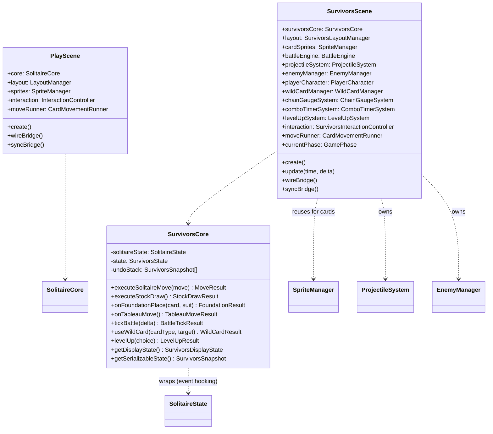
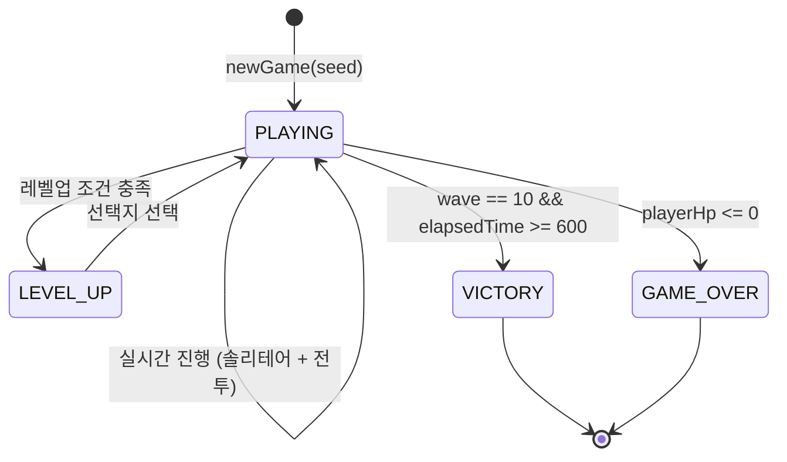

# TRD: Solitaire Survivors Mode

## 1. 기술적 개요

### 시스템 요약
이 TRD는 **Solitaire Survivors** 게임 모드의 기술 아키텍처를 정의한다. Vampire Survivors 스타일의 실시간 생존 메카닉과 Klondike 솔리테어를 결합한 새로운 게임 모드이다.

- **신규**: `SurvivorsScene.ts`, `SurvivorsCore.ts`, `SurvivorsState.ts`, `BattleEngine.ts`, `ProjectileSystem.ts`, `EnemyManager.ts`, `WildCardManager.ts`, `ChainGaugeSystem.ts`, `ComboTimerSystem.ts`, `LevelUpSystem.ts`, `WeaknessSystem.ts`, `BarrierZoneRenderer.ts`
- **확장**: `GameBridge` (survivors 콜백), `LayoutManager` (상하 분할 설정), `SpriteManager` (survivors 스프라이트 배열)
- **완전 재사용**: `CardSprite`, `CardRenderer`, `ThemeManager`, `Deck`, `PileZone`, `CardMovementRunner`, solver 타입 (`Card`, `Suit`, `Move`, `ActionType`), `SolitaireState` (100% 재사용)

### 아키텍처 원칙
1. **Scene 격리**: Survivors 모드는 독립된 `SurvivorsScene`에서 실행, `PlayScene`이나 `DefenseScene`을 수정하지 않음
2. **Bridge 패턴 준수**: 모든 React <-> Phaser 통신은 `GameBridge` 확장을 통해 이루어짐
3. **Core/Scene 분리**: 순수 게임 로직은 `SurvivorsCore`, 렌더링과 애니메이션은 `SurvivorsScene`
4. **래핑 패턴**: `SurvivorsCore`는 `SolitaireState`를 래핑하여 이벤트 후킹, 수정하지 않음
5. **상태 직렬화**: 모든 survivors 상태는 JSON 직렬화 가능 (향후 save/load 지원)

### 기술적 제약사항
- 런타임: 브라우저 (Chrome 90+, Safari 15+, Mobile 브라우저)
- 프레임워크: Phaser 3.80+ (WebGL, Canvas 폴백)
- 언어: TypeScript 5.x (strict mode)
- 번들: Next.js 16 (트리 셰이킹, survivors 모듈 동적 임포트)
- 네이티브 의존성 없음 (순수 브라우저 API)
- 전투 계산은 메인 스레드 (복잡도 낮음, 최대 30 엔티티; Web Worker는 Solver 전용)

---

## 2. Scene 아키텍처

### Scene 클래스 다이어그램



### Scene 생명주기

1. **preload**: No-op (텍스처는 create에서 `CardRenderer`로 생성; survivors 스프라이트는 프로그래밍 방식 렌더링)
2. **create**:
   - `SurvivorsCore` 초기화 (내부에 seed로 `SolitaireState` 생성)
   - `SurvivorsLayoutManager` 생성 (상하 분할 레이아웃)
   - `CardRenderer.generateTextures()`로 카드 텍스처 생성
   - 초기 솔리테어 상태에서 카드 스프라이트 구축 (`SpriteManager` 패턴 재사용)
   - 전투 뷰 요소 생성 (`PlayerCharacter`, `ProjectileSystem`, `EnemyManager`)
   - HUD 요소 생성 (시간/웨이브, 점수, HP 바, 체인 게이지, 야생카드 슬롯)
   - Bridge 콜백 연결
   - 초기 상태를 React에 동기화
   - 페이즈를 `PLAYING`으로 설정
3. **update(time, delta)**:
   - `BattleEngine.tick(delta)` 실행 (적 이동, 투사체 발사/충돌, 피격 처리)
   - `ComboTimerSystem.tick(delta)` (콤보 타이머 감소)
   - `ChainGaugeSystem.tick(delta)` (게이지 자연 감소)
   - `LevelUpSystem.tick(delta)` (경험치 확인, 레벨업 트리거)
   - 모든 스프라이트 위치/애니메이션 업데이트
4. **shutdown**: Bridge 콜백 정리, 모든 스프라이트 파괴, 참조 초기화

### Scene 전환 전략

**라우트 기반 (권장)**:
- `/play` -> `PlayScene` (기존)
- `/defense` -> `DefenseScene` (기존)
- `/survivors` -> `SurvivorsScene` (신규 라우트 + 페이지 컴포넌트)
- `/simulate` -> `SimulateScene` (기존)
- 각 라우트는 `PhaserGameInner`를 통해 독립적인 `Phaser.Game` 인스턴스 생성

기존 패턴과 일치: `/play`와 `/simulate`가 독립 라우트로 분리된 Phaser 인스턴스를 사용하는 것과 동일.

---

## 3. 게임 상태 & 핵심 로직

### 상태 인터페이스

```typescript
// game/survivors/SurvivorsState.ts

interface SurvivorsState {
  /** 현재 게임 페이즈 */
  phase: GamePhase;

  /** 현재 웨이브 번호 (1-10) */
  wave: number;

  /** 경과 시간 (초) */
  elapsedTime: number;

  /** 플레이어 HP (0-100) */
  playerHp: number;

  /** 플레이어 최대 HP */
  playerMaxHp: number;

  /** 누적 점수 */
  score: number;

  /** 플레이어 레벨 */
  level: number;

  /** 경험치 */
  experience: number;

  /** 다음 레벨업 필요 경험치 */
  experienceToNextLevel: number;

  /** Foundation 현재 Tier (Suit별 최고 Rank) */
  foundationTiers: { [suit: string]: number }; // 0-13 (A=1, K=13)

  /** 투사체 수 (Suit별, ceil(Rank/3)) */
  projectileCounts: { [suit: string]: number }; // 0-5

  /** Full Suit 달성 여부 */
  fullSuits: Set<Suit>;

  /** 듀얼 콤보 해금 상태 */
  dualCombos: Set<DualComboType>; // 'red' | 'black' | 'royal'

  /** 콤보 상태 (현재 연속 적재 Suit, 콤보 카운트, 남은 시간) */
  comboState: {
    suit: Suit | null;
    count: number; // 1-4
    timeRemaining: number; // 0-10초
  };

  /** 체인 게이지 (0-100) */
  chainGauge: number;

  /** 체인 버스트 활성 여부 */
  chainBurstActive: boolean;

  /** 체인 버스트 남은 시간 */
  chainBurstTimeRemaining: number; // 0-3초

  /** 야생카드 슬롯 (최대 3-5개, 레벨업으로 확장) */
  wildCards: WildCardType[]; // 'joker' | 'peek' | 'bomb'

  /** 야생카드 최대 슬롯 수 */
  wildCardSlotMax: number; // 3-5

  /** 활성 적 목록 */
  enemies: EnemyData[];

  /** 활성 투사체 목록 */
  projectiles: ProjectileData[];

  /** 레벨업 선택지 활성 여부 */
  levelUpChoicesActive: boolean;

  /** 레벨업 선택지 */
  levelUpChoices: LevelUpChoice[];

  /** 적용된 업그레이드 */
  upgrades: UpgradeEffect[];

  /** 시드 */
  seed: number;

  /** 총 이동 횟수 */
  moveCount: number;

  /** 처치한 적 수 */
  enemiesKilled: number;
}

enum GamePhase {
  PLAYING = 'playing',
  LEVEL_UP = 'level_up',
  VICTORY = 'victory',
  GAME_OVER = 'game_over',
}

enum WildCardType {
  JOKER = 'joker',     // 만능 카드
  PEEK = 'peek',       // face-down 미리보기
  BOMB = 'bomb',       // 듀얼 유즈
}

enum DualComboType {
  RED = 'red',         // Heart + Diamond
  BLACK = 'black',     // Spade + Club
  ROYAL = 'royal',     // 4 Suit 모두
}

interface EnemyData {
  id: string;
  type: EnemyType;
  hp: number;
  maxHp: number;
  atk: number;
  spd: number;
  position: { x: number; y: number };
  direction: { x: number; y: number };
  weakness: Suit; // 개별 적 약점
  isBoss: boolean;
  isMiniBoss: boolean;
}

enum EnemyType {
  GRUNT = 0,
  RUNNER = 1,
  SHIELD = 2,
  RANGER = 3,
  HEALER = 4,
  SIEGE = 5,
  BRUTE = 6,      // 미니보스
  SHADOW = 7,     // 미니보스
  KING_OF_RUIN = 8, // 최종 보스
}

interface ProjectileData {
  id: string;
  suit: Suit;
  type: ProjectileType;
  damage: number;
  position: { x: number; y: number };
  velocity: { x: number; y: number };
  targetId?: string; // 유도 타입용
}

enum ProjectileType {
  SLASH = 'slash',       // Spade: 부채꼴 근접
  HOLY_ORB = 'holy_orb', // Heart: 공전
  ARROW = 'arrow',       // Diamond: 유도 화살
  FIREBALL = 'fireball', // Club: 범위 폭발
}

interface LevelUpChoice {
  category: 'projectile' | 'survival' | 'solitaire';
  name: string;
  description: string;
  effect: UpgradeEffect;
}

interface UpgradeEffect {
  type: string;
  value: number;
  suit?: Suit;
}
```

### 상태 머신



### 핵심 클래스: SurvivorsCore

```typescript
// game/survivors/SurvivorsCore.ts

class SurvivorsCore {
  private state: SurvivorsState;
  private solitaireState: SolitaireState; // 래핑, 수정하지 않음
  private undoStack: SurvivorsSnapshot[];
  private emitter: Phaser.Events.EventEmitter;

  constructor(seed: number) {
    this.solitaireState = new SolitaireState(seed);
    this.state = this.createInitialState(seed);
    this.undoStack = [];
    this.emitter = new Phaser.Events.EventEmitter();
  }

  /** 솔리테어 이동 실행, Foundation 변화 감지 */
  executeSolitaireMove(move: Move): MoveResult {
    const beforeFoundation = this.getFoundationTops();
    const result = this.solitaireState.executeMove(move);
    this.state.moveCount++;

    // Foundation 변화 감지
    const afterFoundation = this.getFoundationTops();
    const foundationChange = this.detectFoundationChange(beforeFoundation, afterFoundation);

    if (foundationChange) {
      this.onFoundationPlace(foundationChange.card, foundationChange.suit);
    }

    // Tableau 이동 감지 (체인 게이지)
    if (move.actionType === ActionType.TABLEAU_TO_TABLEAU) {
      this.onTableauMove();
    }

    this.emitter.emit('stateChanged', this.getDisplayState());
    return result;
  }

  /** Stock 드로우 실행 */
  executeStockDraw(): StockDrawResult {
    const result = this.solitaireState.drawStock();
    this.state.moveCount++;

    // 전체 적 0.5초 감속 효과
    this.emitter.emit('stockDrawn');

    this.emitter.emit('stateChanged', this.getDisplayState());
    return result;
  }

  /** Foundation 적재 이벤트 처리 */
  private onFoundationPlace(card: Card, suit: Suit): void {
    const rank = card.rank;

    // 1. Tier 업데이트
    this.state.foundationTiers[suit] = rank;

    // 2. 투사체 수 재계산
    this.state.projectileCounts[suit] = Math.ceil(rank / 3);

    // 3. 콤보 타이머 체크/업데이트
    const comboMultiplier = this.updateComboTimer(suit);

    // 4. Rank 보너스 계산
    const rankBonus = (rank >= 10) ? 1.3 : 1.0;

    // 5. 즉발 투사체 발사
    const instantDamage = this.calculateProjectileBaseDamage(suit) * comboMultiplier * rankBonus;
    this.emitter.emit('instantProjectile', { suit, damage: instantDamage });

    // 6. 전역 넉백 (0.3초)
    this.emitter.emit('globalKnockback', 0.3);

    // 7. Full Suit 체크 (K 완성)
    if (rank === 13 && !this.state.fullSuits.has(suit)) {
      this.state.fullSuits.add(suit);
      this.emitter.emit('fullSuitAchieved', suit);
    }

    // 8. 듀얼 콤보 체크
    this.checkDualCombos();

    // 9. 경험치 획득 (Foundation 적재 시 소량)
    this.addExperience(5);
  }

  /** Tableau 이동 처리 (체인 게이지) */
  private onTableauMove(): void {
    const increment = this.isComboActive() ? 15 : 10;
    this.state.chainGauge = Math.min(100, this.state.chainGauge + increment);

    if (this.state.chainGauge >= 100) {
      // 체인 버스트 발동
      this.state.chainBurstActive = true;
      this.state.chainBurstTimeRemaining = 3.0;
      this.state.chainGauge = 0;
      this.emitter.emit('chainBurst');
    }
  }

  /** 콤보 타이머 업데이트 */
  private updateComboTimer(suit: Suit): number {
    if (this.state.comboState.suit === suit && this.state.comboState.timeRemaining > 0) {
      // 같은 Suit 연속 적재
      this.state.comboState.count = Math.min(4, this.state.comboState.count + 1);
      this.state.comboState.timeRemaining = 10.0;
    } else {
      // 다른 Suit 또는 타이머 만료
      this.state.comboState.suit = suit;
      this.state.comboState.count = 1;
      this.state.comboState.timeRemaining = 10.0;
    }

    // 콤보 배율: 1콤보=1.0, 2콤보=1.3, 3콤보=1.6, 4콤보=2.0
    const multipliers = [1.0, 1.0, 1.3, 1.6, 2.0];
    return multipliers[this.state.comboState.count];
  }

  /** 듀얼 콤보 체크 */
  private checkDualCombos(): void {
    const tiers = this.state.foundationTiers;

    // Red 콤보: Heart + Diamond 모두 Tier 3 (7장) 이상
    if (tiers[Suit.HEART] >= 7 && tiers[Suit.DIAMOND] >= 7 && !this.state.dualCombos.has(DualComboType.RED)) {
      this.state.dualCombos.add(DualComboType.RED);
      this.emitter.emit('dualComboUnlocked', DualComboType.RED);
    }

    // Black 콤보: Spade + Club 모두 Tier 3 이상
    if (tiers[Suit.SPADE] >= 7 && tiers[Suit.CLUB] >= 7 && !this.state.dualCombos.has(DualComboType.BLACK)) {
      this.state.dualCombos.add(DualComboType.BLACK);
      this.emitter.emit('dualComboUnlocked', DualComboType.BLACK);
    }

    // Royal 콤보: 4 Suit 모두 Tier 3 이상
    if (tiers[Suit.SPADE] >= 7 && tiers[Suit.HEART] >= 7 &&
        tiers[Suit.DIAMOND] >= 7 && tiers[Suit.CLUB] >= 7 &&
        !this.state.dualCombos.has(DualComboType.ROYAL)) {
      this.state.dualCombos.add(DualComboType.ROYAL);
      this.emitter.emit('dualComboUnlocked', DualComboType.ROYAL);
    }
  }

  /** 전투 틱 (메인 루프에서 호출) */
  tickBattle(delta: number): BattleTickResult {
    // delta는 밀리초
    const deltaSec = delta / 1000.0;

    // 1. 시간 업데이트
    this.state.elapsedTime += deltaSec;

    // 2. 웨이브 업데이트
    const newWave = Math.floor(this.state.elapsedTime / 60) + 1;
    if (newWave > this.state.wave && this.state.wave < 10) {
      this.advanceWave();
    }

    // 3. 콤보 타이머 감소
    if (this.state.comboState.timeRemaining > 0) {
      this.state.comboState.timeRemaining -= deltaSec;
      if (this.state.comboState.timeRemaining <= 0) {
        this.state.comboState.count = 0;
        this.state.comboState.suit = null;
      }
    }

    // 4. 체인 게이지 자연 감소 (10초 대기 후 초당 -5%)
    // (구현 생략)

    // 5. 체인 버스트 시간 감소
    if (this.state.chainBurstActive) {
      this.state.chainBurstTimeRemaining -= deltaSec;
      if (this.state.chainBurstTimeRemaining <= 0) {
        this.state.chainBurstActive = false;
      }
    }

    // 6. 승리/패배 체크
    if (this.state.playerHp <= 0) {
      this.state.phase = GamePhase.GAME_OVER;
      this.emitter.emit('gameOver');
    } else if (this.state.wave >= 10 && this.state.elapsedTime >= 600) {
      this.state.phase = GamePhase.VICTORY;
      this.emitter.emit('victory');
    }

    return { /* 전투 결과 */ };
  }

  /** 웨이브 진행 */
  private advanceWave(): void {
    this.state.wave++;

    // face-down 카드 1장 자동 reveal
    const faceDownCards = this.solitaireState.getFaceDownCards();
    if (faceDownCards.length > 0) {
      const randomCard = faceDownCards[Math.floor(Math.random() * faceDownCards.length)];
      this.solitaireState.revealCard(randomCard);
      this.emitter.emit('cardRevealed', randomCard);
    }

    this.emitter.emit('waveAdvanced', this.state.wave);
  }

  /** 야생카드 사용 */
  useWildCard(cardType: WildCardType, target: any): WildCardResult {
    // 슬롯에서 제거
    const index = this.state.wildCards.indexOf(cardType);
    if (index === -1) return { success: false };
    this.state.wildCards.splice(index, 1);

    switch (cardType) {
      case WildCardType.JOKER:
        // Foundation에 적재 (target = suit)
        return this.useJoker(target);
      case WildCardType.PEEK:
        // face-down 미리보기 (target = card indices)
        return this.usePeek(target);
      case WildCardType.BOMB:
        // target에 따라 Foundation(폭발) 또는 Tableau(뒤집기)
        return this.useBomb(target);
    }
  }

  /** 레벨업 */
  levelUp(choice: LevelUpChoice): void {
    // 선택지 적용
    this.applyUpgrade(choice.effect);
    this.state.upgrades.push(choice.effect);

    // 레벨업 UI 닫기
    this.state.levelUpChoicesActive = false;
    this.state.levelUpChoices = [];
    this.state.phase = GamePhase.PLAYING;

    this.emitter.emit('levelUpApplied', choice);
  }

  /** 표시 상태 반환 */
  getDisplayState(): SurvivorsDisplayState { ... }

  /** 직렬화 가능한 스냅샷 반환 */
  getSerializableState(): SurvivorsSnapshot { ... }

  /** 이벤트 구독 */
  on(event: string, callback: Function): void { this.emitter.on(event, callback); }
  off(event: string, callback: Function): void { this.emitter.off(event, callback); }
}
```

### SolitaireState 래핑 전략

기존 `SolitaireState`는 수정하지 않고, `SurvivorsCore` 내에서 **이벤트 후킹 래퍼**로 감싼다.

```typescript
// SurvivorsCore 내부
executeSolitaireMove(move: Move): MoveResult {
  // Foundation 상태 스냅샷
  const beforeFoundation = {
    spade: this.solitaireState.foundation[Suit.SPADE].length,
    heart: this.solitaireState.foundation[Suit.HEART].length,
    diamond: this.solitaireState.foundation[Suit.DIAMOND].length,
    club: this.solitaireState.foundation[Suit.CLUB].length,
  };

  // 원본 SolitaireState에 이동 적용
  const result = this.solitaireState.applyMove(move);

  // Foundation 변화 감지
  const afterFoundation = { /* 동일 */ };

  for (const suit of [Suit.SPADE, Suit.HEART, Suit.DIAMOND, Suit.CLUB]) {
    if (afterFoundation[suit] > beforeFoundation[suit]) {
      const topCard = this.solitaireState.foundation[suit][afterFoundation[suit] - 1];
      this.onFoundationPlace(topCard, suit);
    }
  }

  // Tableau 이동 감지
  if (move.actionType === ActionType.TABLEAU_TO_TABLEAU) {
    this.onTableauMove();
  }

  return result;
}
```

이를 통해 `SolitaireState`의 로직은 일체 변경하지 않으면서, Foundation 적재 / Tableau 이동 등의 이벤트를 전투 시스템에 전달한다.

---

## 4. GameBridge 이벤트 확장

### 기존 이벤트 (재사용 가능)
| 이벤트 | 페이로드 | 용도 |
|-------|---------|------|
| `stateChanged` | `GameDisplayState` | 솔리테어 조작 후 카드 스프라이트 업데이트 |
| `undo` | -- | 솔리테어 실행 취소 |
| `requestHint` | -- | Solver 힌트 트리거 |
| `hintResult` | `Move \| null` | Tableau에 힌트 표시 |

### 신규 이벤트

```typescript
// game/survivors/events.ts

interface SurvivorsEvents {
  /** 전체 survivors 상태 업데이트 */
  'survivorsStateChanged': (state: SurvivorsDisplayState) => void;

  /** Foundation 적재 (즉발 투사체 트리거) */
  'foundationPlaced': (card: Card, suit: Suit, damage: number) => void;

  /** 콤보 트리거 */
  'comboTriggered': (suit: Suit, count: number, multiplier: number) => void;

  /** 체인 버스트 발동 */
  'chainBurst': () => void;

  /** Full Suit 달성 */
  'fullSuitAchieved': (suit: Suit) => void;

  /** 듀얼 콤보 해금 */
  'dualComboUnlocked': (comboType: DualComboType) => void;

  /** 적 스폰 */
  'enemySpawned': (enemy: EnemyData) => void;

  /** 적 처치 */
  'enemyKilled': (enemy: EnemyData, score: number) => void;

  /** 플레이어 피격 */
  'playerHit': (damage: number, remainingHp: number) => void;

  /** 야생카드 드랍 */
  'wildCardDropped': (cardType: WildCardType) => void;

  /** 레벨업 */
  'levelUp': (level: number, choices: LevelUpChoice[]) => void;

  /** 웨이브 진행 */
  'waveAdvanced': (wave: number) => void;

  /** 게임 오버/승리 */
  'survivorsGameOver': (result: { won: boolean; score: number; wave: number; time: number }) => void;
}
```

### 콜백 확장

```typescript
// GameBridge에 추가될 콜백

interface SurvivorsBridgeCallbacks {
  /** 야생카드 사용 (React -> Scene) */
  useWildCardCallback: ((cardType: WildCardType, target: any) => void) | null;

  /** 레벨업 선택지 선택 (React -> Scene) */
  selectLevelUpCallback: ((choice: LevelUpChoice) => void) | null;

  /** 새 survivors 게임 시작 (React -> Scene) */
  newSurvivorsGameCallback: ((seed?: number) => void) | null;

  /** 일시정지 토글 (React -> Scene) */
  togglePauseCallback: (() => void) | null;
}
```

**구현 결정**: 기존 `GameBridge` 클래스를 이 콜백들로 확장. Defense 모드와 동일한 **직접 콜백 패턴** 사용. React strict mode double-mount 대응을 위해 cleanup 시 콜백 해제.

---

## 5. 렌더링 & 레이아웃

### 레이아웃 설정

```typescript
// game/survivors/SurvivorsLayoutManager.ts

interface SurvivorsLayoutConfig {
  /** HUD 영역 (최상단) */
  hudArea: {
    x: number; y: number;
    width: number; height: number; // 5% 높이
  };

  /** 전투 뷰 영역 (상단) */
  battleArea: {
    x: number; y: number;
    width: number; height: number; // 55% 높이
    centerPoint: { x: number; y: number }; // 플레이어 위치
  };

  /** 중간 바 (체인 게이지 + 야생카드) */
  middleBar: {
    x: number; y: number;
    width: number; height: number; // 5% 높이
  };

  /** 솔리테어 영역 (하단) */
  solitaireArea: {
    x: number; y: number;
    width: number; height: number; // 35% 높이
  };

  /** 솔리테어 내 카드 배치 (재사용) */
  cardLayout: {
    foundations: { x: number; y: number }[];
    stock: { x: number; y: number };
    waste: { x: number; y: number };
    tableau: { x: number; y: number }[];
  };

  /** 카드 크기 */
  cardWidth: number;
  cardHeight: number;
}
```

### 화면 분할 비율
- **Desktop (1024px+)**: HUD 5%, 전투 55%, 중간 바 5%, 솔리테어 35%
- **Tablet (768-1023px)**: 동일 비율 유지, 카드 크기 80% 축소
- **Mobile (<768px)**: 스와이프 전환 방식
  - 기본 뷰: 전투 뷰 (80%) + 솔리테어 미니맵 (20%)
  - 스와이프 업 → 솔리테어 뷰 (80%) + 전투 미니맵 (20%)

### Layer/Depth 전략
| Layer | Depth Range | 내용 |
|-------|------------|------|
| Background | 0-99 | 배경, 결계 존 영역 |
| Cards (static) | 100-999 | Tableau/Foundation/Stock/Waste 카드 |
| Battle elements | 1000-4999 | 플레이어 캐릭터, 적, 투사체 |
| Cards (dragging) | 5000-9999 | 드래그 중인 카드 |
| UI Overlay | 10000-14999 | HUD, HP 바, 체인 게이지, 야생카드 슬롯 |
| Effects | 15000-19999 | 파티클, 콤보 텍스트, 데미지 숫자 |
| Modal | 20000+ | 레벨업 선택지, 게임 오버 화면 |

---

## 6. 상호작용 설계

### 상호작용 맵
| 입력 | 컨텍스트 | 액션 | 핸들러 |
|------|---------|------|--------|
| 클릭 | Tableau 카드 | 선택/자동 이동 | `InteractionController` (재사용) |
| 드래그 앤 드롭 | 카드 -> Tableau/Foundation | 솔리테어 이동 | `InteractionController` -> `SurvivorsCore` |
| 클릭 | Stock 파일 | 3장 드로우 | `InteractionController` (재사용) |
| 더블 클릭 | Tableau/Waste 카드 | Foundation 자동 이동 | `InteractionController` (재사용) |
| 클릭 | 야생카드 슬롯 | 야생카드 선택 | `SurvivorsInteractionController` |
| 드래그 앤 드롭 | 야생카드 -> Foundation/Tableau | 야생카드 사용 | `SurvivorsInteractionController` |
| 클릭 | 레벨업 선택지 카드 | 선택지 선택 | React 콜백 -> `selectLevelUpCallback` |
| 호버 | 적/투사체 | 툴팁 표시 | `SurvivorsScene` 툴팁 핸들러 |

### 야생카드 상호작용

**Joker**:
- 드래그하여 원하는 Foundation에 드롭
- 해당 Foundation의 다음 Rank로 취급
- 즉시 투사체 효과 발동

**Peek**:
- 클릭 후 Tableau의 face-down 카드 클릭
- 10초간 해당 카드의 앞면을 반투명 오버레이로 표시

**Bomb (듀얼 유즈)**:
- Foundation에 드롭 → 전체 화면 폭발 공격
- Tableau에 드롭 → face-down 2장 자동 뒤집기

---

## 7. 엔티티 & 컴포넌트 설계

### 신규 게임 오브젝트

| 오브젝트 | 베이스 클래스 | 설명 |
|---------|------------|------|
| `PlayerCharacter` | `Phaser.GameObjects.Container` | 플레이어 캐릭터 (중앙 고정, HP 바, 무적 표시) |
| `EnemySprite` | `Phaser.GameObjects.Container` | 적 스프라이트 (타입별 모양, HP 바, 약점 아이콘) |
| `ProjectileSprite` | `Phaser.GameObjects.Sprite` | 투사체 스프라이트 (Suit별 색상/모양) |
| `BarrierZone` | `Phaser.GameObjects.Graphics` | 결계 영역 (빈 Tableau 열에 대응) |
| `DamageNumber` | `Phaser.GameObjects.Text` | 떠오르는 데미지/회복 숫자 |
| `ChainGaugeBar` | `Phaser.GameObjects.Container` | 체인 게이지 UI |
| `WildCardSlot` | `Phaser.GameObjects.Container` | 야생카드 슬롯 UI |
| `LevelUpCard` | `Phaser.GameObjects.Container` | 레벨업 선택지 카드 UI |

### SpriteManager 전략

**접근법**: `SurvivorsSpriteManager` 생성, 기존 `SpriteManager`를 카드 관리용으로 조합하고 survivors 전용 스프라이트 풀 추가:

```typescript
class SurvivorsSpriteManager {
  /** 재사용: Tableau/Foundation/Stock/Waste 카드 스프라이트 관리 */
  cardSprites: SpriteManager;

  /** 신규: 플레이어 캐릭터 */
  playerCharacter: PlayerCharacter;

  /** 신규: 적 스프라이트 */
  enemySprites: Map<string, EnemySprite>;

  /** 신규: 투사체 스프라이트 */
  projectileSprites: Map<string, ProjectileSprite>;

  /** 신규: 야생카드 슬롯 */
  wildCardSlots: WildCardSlot[];

  /** 솔리테어 상태에서 카드 스프라이트 재구축 */
  rebuildCards(state: SolverSnapshot): void { ... }

  /** 상태에 맞춰 적 스프라이트 동기화 */
  syncEnemies(enemies: EnemyData[]): void { ... }

  /** 상태에 맞춰 투사체 스프라이트 동기화 */
  syncProjectiles(projectiles: ProjectileData[]): void { ... }

  /** 야생카드 슬롯 업데이트 */
  syncWildCards(wildCards: WildCardType[]): void { ... }

  /** 모든 스프라이트 파괴 */
  destroyAll(): void { ... }
}
```

### 플레이어 시각 설계 (프로그래밍 방식)

- **모양**: 원형 (반지름 20px)
- **색상**: 흰색 (#FFFFFF)
- **HP 바**: 캐릭터 위 20px, 40px 너비, 녹색->노랑->빨강 그라데이션
- **무적 표시**: 반투명 (alpha 0.5) + 흰색 외곽선 깜빡임
- **위치**: 전투 영역 중앙 고정

### 적 시각 설계 (프로그래밍 방식)

- **모양**:
  - Grunt, Runner, Healer: 원형 (반지름 10px)
  - Shield, Siege: 육각형 (반지름 12px)
  - Ranger: 삼각형 (높이 15px)
  - 미니보스: 별 모양 (반지름 20px)
  - 최종 보스: 큰 별 모양 (반지름 40px)
- **색상**: 어두운 빨강 (#8B0000)
- **약점 아이콘**: 적 위에 Suit 심볼 (♠️/♥️/♦️/♣️)
- **HP 바**: 적 위 4px 높이

### 투사체 시각 설계

| Suit | 투사체 | 모양 | 색상 | 크기 |
|------|--------|------|------|------|
| Spade | Slash | 부채꼴 아크 | 보라 (#9B59B6) | 60도 각도 |
| Heart | Holy Orb | 원형 | 빨강 (#E74C3C) | 반지름 8px |
| Diamond | Arrow | 삼각형 | 파랑 (#3498DB) | 길이 15px |
| Club | Fireball | 원형 (폭발 시 확대) | 초록/주황 (#2ECC71/#E67E22) | 반지름 10px |

---

## 8. AI & Solver 적응

### 결정 매트릭스
| 질문 | 답변 | 액션 |
|------|------|------|
| 표준 솔리테어 이동을 사용하는가? | 예 | `NestedRolloutSolver` 재사용 (힌트 기능) |
| 새로운 이동 타입을 추가하는가? | 아니오 (표준 Klondike) | Solver 수정 불필요 |
| 자동 해결이 필요한가? | 아니오 (실시간 진행 중) | 스킵 |
| AI 상대가 필요한가? | 아니오 (적은 사전 설정 패턴) | 스킵 |

### 힌트 시스템

실시간 진행 중에도 힌트 기능은 사용 가능:

1. 플레이어가 "Hint" 클릭
2. `GameBridge.showHintCallback`이 현재 `SolverSnapshot`으로 `NestedRolloutSolver.solveOneMove()` 호출
3. 최선의 솔리테어 이동이 하이라이트됨

**제한사항**: Solver는 솔리테어 완성을 최적화하며, 현재 웨이브의 Suit 약점이나 전투 상황은 고려하지 않음.

**향후 개선 (Phase 2)**: 전투 상황을 고려하는 `SurvivorsEvaluator` 생성:
- 현재 웨이브의 적 약점 Suit에 맞춰 Foundation 이동 점수 조정
- 투사체 수가 적은 Suit 우선순위 증가
- 급박한 전투 상황에서 즉시 Foundation 적재 유도

---

## 9. 애니메이션 & 이펙트

### 재사용 애니메이션
| 효과 | 소스 | 용도 |
|------|------|------|
| 카드 이동 (Sine) | `CardMovementRunner` + `SineMovement` | 솔리테어 이동 |
| 카드 뒤집기 | `CardSprite.flip()` | face-down 카드 공개 |
| 힌트 글로우 | `HintRenderer` | 힌트 하이라이트 |

### 신규 애니메이션
| 효과 | 트리거 | 설명 | 구현 |
|------|--------|------|------|
| Foundation 적재 플래시 | Foundation 적재 | Suit 색상 섬광 + 즉발 투사체 발사 | Camera flash + 투사체 스폰 트윈 |
| 콤보 텍스트 | 2+ 연속 같은 Suit | "Combo x{N}!" 텍스트 팝업 | 떠오르는 텍스트, 스케일 업 트윈 |
| 체인 버스트 | 체인 게이지 100% | 황금빛 테두리 + 투사체 잔상 | 화면 테두리 글로우 + 파티클 트레일 |
| Full Suit 궁극기 | K 완성 | Suit별 특수 효과 애니메이션 | Suit 색상 전체 화면 플래시 + 특수 파티클 |
| 듀얼 콤보 해금 | Tier 3 조건 충족 | 배너 슬라이드 인 + 융합 투사체 첫 발사 | Container 슬라이드 트윈 |
| 투사체 발사 | 자동 발사 (타이머) | Suit별 발사 애니메이션 | 스프라이트 트윈 (직선/곡선) |
| 적 피격 | 투사체 충돌 | 빨간 플래시 + 넉백 | Alpha 플래시 + 위치 트윈 |
| 적 처치 | 적 HP 0 | 축소 + 페이드 + 점수 팝업 | Scale 0 + alpha 0 트윈 + 떠오르는 텍스트 |
| 플레이어 피격 | 적 접촉 | 화면 진동 + 화이트 플래시 | Camera shake + 플레이어 플래시 |
| 레벨업 | 경험치 충족 | 슬로우 모션 (0.2배속) + 선택지 카드 등장 | Time scale + 카드 스케일 업 트윈 |
| 야생카드 드랍 | 적 처치 시 15% | 카드 아이콘이 슬롯으로 날아감 | 베지어 곡선 트윈 |
| 웨이브 클리어 | 웨이브 종료 | "WAVE X CLEAR" + face-down 자동 reveal | 중앙 텍스트 + 카드 회전 애니메이션 |
| 승리 | 10분 생존 | 축하 파티클 + 최종 점수 화면 | 파티클 버스트 + 모달 슬라이드 |
| 게임 오버 | HP 0 | 화면 어두워짐 + "GAME OVER" | 다크 오버레이 + 중앙 텍스트 |

---

## 10. 오디오 설계

| 카테고리 | 트리거 | 에셋 | 비고 |
|---------|--------|------|------|
| SFX | 카드 이동 | 기존 재사용 | 기존 솔리테어 사운드 |
| SFX | Foundation 적재 | 신규 | 금속성 "딩" + Suit별 코드 |
| SFX | 콤보 트리거 | 신규 | 상승 차임 (콤보 수에 따라 피치 상승) |
| SFX | 체인 버스트 | 신규 | 강력한 "쿵" + 에코 |
| SFX | Full Suit | 신규 | 승리 팡파르 |
| SFX | 투사체 발사 | 신규 | Suit별 사운드 (휘두르기/성가/화살/폭발) |
| SFX | 투사체 히트 | 신규 | 충돌음 (타입별) |
| SFX | 적 처치 | 신규 | "쾅" + 소멸음 |
| SFX | 플레이어 피격 | 신규 | 무거운 충격음 + 경보 |
| SFX | 야생카드 드랍 | 신규 | 반짝이는 종소리 |
| SFX | 레벨업 | 신규 | 승리 코드 |
| SFX | 웨이브 클리어 | 신규 | 짧은 승리 팡파르 |
| BGM | 실시간 플레이 | 신규 [TBD] | 전략적이면서 긴장감 있는 음악 |
| BGM | 레벨업 선택 | 신규 [TBD] | 슬로우 모션 중 차분한 음악 |
| BGM | 승리 | 신규 [TBD] | 승리 테마 |
| BGM | 게임 오버 | 신규 [TBD] | 침울한, 짧은 음악 |

`[가정]` 오디오 에셋은 로열티 프리 라이브러리에서 소싱하거나 생성. MVP에서는 커스텀 작곡 계획 없음.

---

## 11. React 통합

### 신규 컴포넌트
| 컴포넌트 | 경로 | 설명 |
|---------|------|------|
| `SurvivorsPage` | `app/survivors/page.tsx` | Next.js 라우트 페이지, `PhaserGameInner`로 `SurvivorsScene` 초기화 |
| `SurvivorsControls` | `components/SurvivorsControls.tsx` | HUD 및 제어 패널 (일시정지, 재시작) |
| `SurvivorsHUD` | `components/SurvivorsHUD.tsx` | 시간/웨이브, 점수, HP 바 - React 오버레이 |
| `ChainGaugeUI` | `components/ChainGaugeUI.tsx` | 체인 게이지 바 UI |
| `WildCardPanel` | `components/WildCardPanel.tsx` | 야생카드 슬롯 표시 |
| `LevelUpModal` | `components/LevelUpModal.tsx` | 레벨업 선택지 모달 |
| `GameOverModal` | `components/GameOverModal.tsx` | 최종 점수, 등급, 통계 |
| `SurvivorsTooltip` | `components/SurvivorsTooltip.tsx` | 호버 시 적/투사체 정보 툴팁 |

### 신규 Hook

```typescript
// hooks/useSurvivorsState.ts

interface SurvivorsDisplayState {
  phase: GamePhase;
  wave: number;
  elapsedTime: number;
  playerHp: number;
  playerMaxHp: number;
  score: number;
  level: number;
  experience: number;
  experienceToNextLevel: number;
  foundationTiers: { [suit: string]: number };
  projectileCounts: { [suit: string]: number };
  fullSuits: Suit[];
  dualCombos: DualComboType[];
  comboState: { suit: Suit | null; count: number; timeRemaining: number };
  chainGauge: number;
  chainBurstActive: boolean;
  wildCards: WildCardType[];
  wildCardSlotMax: number;
  levelUpChoicesActive: boolean;
  levelUpChoices: LevelUpChoice[];
  isVictory: boolean;
  isGameOver: boolean;
}

function useSurvivorsState(bridge: GameBridge): {
  state: SurvivorsDisplayState | null;
  useWildCard: (cardType: WildCardType, target: any) => void;
  selectLevelUp: (choice: LevelUpChoice) => void;
  newGame: (seed?: number) => void;
  togglePause: () => void;
}
```

### 라우트 구조

```
web/src/app/
  page.tsx                # 메인 메뉴 ("Survivors Mode" 버튼 추가)
  play/page.tsx           # 기존: 코어 솔리테어
  simulate/page.tsx       # 기존: 시뮬레이션
  defense/page.tsx        # 기존: 디펜스 모드
  survivors/page.tsx      # 신규: Survivors 모드
```

---

## 12. 성능 예산

| 메트릭 | 코어 솔리테어 | Survivors 모드 예산 | 결합 최대 |
|--------|--------------|-------------------|----------|
| 메모리 (heap) | ~30 MB | +20 MB | 50 MB |
| JS 번들 (gzipped) | ~180 KB | +80 KB | 260 KB |
| FPS (목표) | 60 | 60 | 60 |
| Scene 초기화 시간 | < 500ms | < 800ms | -- |
| 카드 텍스처 | 53 텍스처 | +0 (공유) | 53 텍스처 |
| Survivors 엔티티 | 0 | 최대 60 (30 적 + 20 투사체 + 10 기타) | 60 |
| 동시 트윈 | ~5 | 최대 30 (전투 애니메이션) | 30 |

**규칙**:
- Survivors 모드는 코어 솔리테어 성능을 저하시키면 안 됨 (독립 씬, 공유 텍스처)
- 카드 텍스처는 `CardRenderer`를 통해 공유 (게임 인스턴스당 1회 생성)
- Survivors 전용 코드는 Next.js 동적 임포트(`next/dynamic`)로 지연 로딩
- 전투 틱은 프레임당 < 2ms 완료 (60fps 시 16ms 예산에서 여유 확보)
- 전투 영역의 최대 게임 오브젝트 60개 (30 적 + 20 투사체 + 10 UI/효과)

---

## 13. 분석 & 이벤트

### 이벤트 분류
| 이벤트 이름 | 카테고리 | 트리거 | 속성 |
|-----------|---------|--------|------|
| `survivors_entered` | Navigation | 사용자가 `/survivors` 진입 | `{ source }` |
| `survivors_game_started` | Session | 새 survivors 게임 | `{ seed }` |
| `survivors_wave_started` | Gameplay | 웨이브 시작 | `{ wave, time }` |
| `survivors_card_moved` | Gameplay | 솔리테어 이동 | `{ wave, actionType, toFoundation }` |
| `survivors_foundation_placed` | Gameplay | Foundation 적재 | `{ wave, suit, rank, comboCount, damage }` |
| `survivors_combo_triggered` | Gameplay | 콤보 발동 | `{ wave, suit, comboCount, multiplier }` |
| `survivors_chain_burst` | Gameplay | 체인 버스트 발동 | `{ wave, time }` |
| `survivors_full_suit_achieved` | Gameplay | Full Suit 달성 | `{ wave, suit }` |
| `survivors_dual_combo_unlocked` | Gameplay | 듀얼 콤보 해금 | `{ wave, comboType }` |
| `survivors_wildcard_dropped` | Gameplay | 야생카드 드랍 | `{ wave, cardType }` |
| `survivors_wildcard_used` | Gameplay | 야생카드 사용 | `{ wave, cardType, target }` |
| `survivors_level_up` | Gameplay | 레벨업 | `{ wave, level, category }` |
| `survivors_enemy_killed` | Gameplay | 적 처치 | `{ wave, enemyType, isBoss }` |
| `survivors_player_hit` | Gameplay | 플레이어 피격 | `{ wave, damage, remainingHp }` |
| `survivors_wave_cleared` | Gameplay | 웨이브 클리어 | `{ wave, time, enemiesKilled }` |
| `survivors_game_won` | Session | 10분 생존 | `{ score, level, foundationProgress, time }` |
| `survivors_game_lost` | Session | HP 0 | `{ wave, score, level, time }` |
| `survivors_hint_used` | Assistance | 힌트 사용 | `{ wave, time }` |
| `survivors_game_abandoned` | Session | 중도 이탈 | `{ wave, time }` |

**네이밍 규칙**: 모든 survivors 이벤트는 `survivors_` 접두사로 구별.

---

## 14. 테스트 전략

| 타입 | 범위 | 도구 | 커버리지 목표 |
|------|------|------|-------------|
| Unit | `SurvivorsCore` 상태 전환 | `npx tsx test-survivors.ts` | 모든 페이즈 전환; Foundation->투사체 변환; 콤보/체인 로직 |
| Unit | `BattleEngine` 전투 계산 | `npx tsx test-survivors.ts` | 데미지 계산 (약점/내성); 충돌 감지; 투사체 타겟팅 |
| Unit | `ProjectileSystem` 발사 로직 | `npx tsx test-survivors.ts` | Suit별 발사 패턴; 투사체 수 계산; Full Suit 특수 효과 |
| Unit | `ComboTimerSystem` 콤보 계산 | `npx tsx test-survivors.ts` | 콤보 타이머; 배율 계산; 리셋 조건 |
| Unit | `LevelUpSystem` 레벨업 로직 | `npx tsx test-survivors.ts` | 경험치 누적; 레벨업 트리거; 업그레이드 적용 |
| Integration | 솔리테어 -> Foundation -> 투사체 | Manual / Playwright | 전체 흐름: 카드 플레이, 투사체 발사 확인 |
| Integration | 적 처치 -> 야생카드 드랍 | Manual / Playwright | 드랍 확률 검증, 슬롯 관리 |
| Integration | 10분 세션 (10 웨이브) | Manual | 게임 시작부터 종료까지 |
| Regression | `PlayScene`, `SolitaireCore` | 기존 `test-solver.ts` | 코어 솔리테어 무손상 |
| Regression | `DefenseScene` | Manual | 디펜스 모드 정상 작동 |
| Visual | SurvivorsScene 레이아웃 | 스크린샷 비교 | 상하 분할, HUD, 중간 바 위치 정확 |
| Performance | Scene 초기화, FPS, 메모리 | Chrome DevTools | 초기화 < 800ms, 60fps 유지 (30 적), heap < 50MB |
| Balance | 웨이브별 승률 | Analytics / 배치 시뮬레이션 | Wave 1: 95%, Wave 5: 70%, Wave 10: 30% |

---

## 15. 파일 구조

```
web/src/
  app/
    survivors/
      page.tsx                          # 신규 - Survivors 모드 라우트
  components/
    SurvivorsControls.tsx               # 신규 - HUD 및 제어
    SurvivorsHUD.tsx                    # 신규 - 시간/웨이브/점수/HP 오버레이
    ChainGaugeUI.tsx                    # 신규 - 체인 게이지 바
    WildCardPanel.tsx                   # 신규 - 야생카드 슬롯
    LevelUpModal.tsx                    # 신규 - 레벨업 선택지
    GameOverModal.tsx                   # 신규 - 최종 결과
    SurvivorsTooltip.tsx                # 신규 - 툴팁
  game/
    scenes/
      SurvivorsScene.ts                 # 신규 - 메인 Survivors Phaser 씬
    survivors/
      SurvivorsCore.ts                  # 신규 - 순수 survivors 게임 로직
      SurvivorsState.ts                 # 신규 - 상태 타입 & 인터페이스
      BattleEngine.ts                   # 신규 - 2D 전투 시뮬레이션
      ProjectileSystem.ts               # 신규 - 투사체 관리 (발사, 풀링, 타겟팅)
      EnemyManager.ts                   # 신규 - 적 스폰 & 관리
      PlayerCharacter.ts                # 신규 - 플레이어 캐릭터 (중앙 고정, HP, 넉백)
      WildCardManager.ts                # 신규 - 야생카드 드랍/사용
      ChainGaugeSystem.ts               # 신규 - 체인 게이지 충전/버스트
      ComboTimerSystem.ts               # 신규 - 콤보 타이머 & 배율 계산
      LevelUpSystem.ts                  # 신규 - 경험치 & 레벨업 선택지
      WeaknessSystem.ts                 # 신규 - 적 약점 부여/표시/데미지 계산
      BarrierZoneRenderer.ts            # 신규 - 결계 영역 렌더링 (빈 Tableau 열)
      SurvivorsLayoutManager.ts         # 신규 - 상하 분할 레이아웃 설정
      SurvivorsSpriteManager.ts         # 신규 - 카드 + survivors 스프라이트 관리
      SurvivorsInteractionController.ts # 신규 - 야생카드 드래그 앤 드롭 처리
      events.ts                         # 신규 - Survivors 이벤트 타입 정의
      constants.ts                      # 신규 - 밸런스 상수 (HP, ATK, 스폰 간격 등)
    objects/
      EnemySprite.ts                    # 신규 - 적 시각 컴포넌트
      ProjectileSprite.ts               # 신규 - 투사체 시각 컴포넌트
      DamageNumber.ts                   # 신규 - 떠오르는 데미지 텍스트
    effects/
      SurvivorsEffects.ts               # 신규 - 콤보, Full Suit, 전투 효과
  hooks/
    useSurvivorsState.ts                # 신규 - Survivors React 상태 훅
  solver/
    (변경 없음, MVP)                     # 기존 solver 그대로 재사용
```

**총 신규 파일**: ~30개
**수정 파일**: ~3개 (메인 메뉴 page.tsx, GameBridge.ts survivors 콜백 추가, game config.ts SurvivorsScene 등록)

---

## 16. 부록

### GDD / PRD 상호 참조
| TRD 섹션 | PRD 기능 | GDD 소스 |
|----------|---------|---------|
| Scene 아키텍처 | SurvivorsScene, `/survivors` 라우트 | `[GDD: 05-ui-and-integration]` |
| 게임 상태 | 실시간 동시 진행, SurvivorsState | `[GDD: 01-core-loop]` |
| 게임 상태 | 투사체 데이터 모델 | `[GDD: 02-projectile-system]` |
| 게임 상태 | 적 데이터 모델 | `[GDD: 03-enemy-and-wave]` |
| GameBridge 이벤트 | Foundation->투사체 변환 | `[GDD: 01-core-loop, 02-projectile-system]` |
| 렌더링 | 상하 분할 레이아웃 | `[GDD: 05-ui-and-integration]` |
| 상호작용 | 야생카드 드래그 앤 드롭 | `[GDD: 04-feedback-and-safety]` |
| 엔티티 설계 | EnemySprite, ProjectileSprite | `[GDD: 02-projectile-system, 03-enemy-and-wave]` |
| AI & Solver | 힌트 시스템 | `[GDD: 05-ui-and-integration]` |
| 애니메이션 | 전투 효과, 콤보 플래시 | `[GDD: 05-ui-and-integration]` |
| React 통합 | Survivors 제어, HUD | `[GDD: 05-ui-and-integration]` |

### 아키텍처 결정 기록 (ADR)

#### ADR-1: SolitaireState 래핑 패턴
- **상태**: 승인됨
- **컨텍스트**: SurvivorsCore가 SolitaireState의 Klondike 로직을 사용하되 Foundation 이벤트를 후킹해야 함
- **결정**: SolitaireState를 래핑하여 조합 (`SurvivorsCore` has-a `SolitaireState`), Foundation 이동을 가로채서 투사체 생성 트리거
- **고려한 대안**: (a) SolitaireState 서브클래싱 -- 거부: SolitaireState가 상태와 강하게 결합됨; (b) SolitaireState 수정하여 이벤트 발생 -- 거부: 안정적이고 테스트된 코드 변경 회피
- **결과**: 약간 더 장황한 코드 (위임 메서드), 하지만 코어 솔리테어 안정성에 제로 리스크

#### ADR-2: 라우트 기반 Scene 전환
- **상태**: 승인됨
- **컨텍스트**: 코어 솔리테어와 survivors 모드 간 전환 필요
- **결정**: 각 모드는 독립적인 Next.js 라우트 (`/play`, `/survivors`)로 독립된 Phaser.Game 인스턴스 사용
- **고려한 대안**: SceneManager로 씬 전환하는 단일 Phaser.Game -- 거부: 복잡한 생명주기 관리 및 씬 간 상태 누수 가능성
- **결과**: 깨끗한 격리; 독립 Phaser 인스턴스의 약간의 메모리 비용 (지연 로딩으로 완화)

#### ADR-3: 메인 스레드 전투 계산
- **상태**: 승인됨
- **컨텍스트**: BattleEngine이 각 프레임마다 전투를 시뮬레이션해야 함
- **결정**: 메인 스레드에서 전투 계산 실행 (최대 30 엔티티로 틱당 < 2ms)
- **고려한 대안**: 전투용 Web Worker -- 거부: 통신 오버헤드가 계산 비용 초과; Worker는 Solver 전용
- **결과**: 성능 예산 내 유지를 위해 30 엔티티 상한 강제해야 함

#### ADR-4: 프로그래밍 방식 스프라이트 생성
- **상태**: 승인됨
- **컨텍스트**: 플레이어, 적, 투사체의 시각 표현 필요; 아티스트 사용 불가
- **결정**: Phaser 프리미티브(사각형, 원, 텍스트)로 색상 코딩된 프로그래밍 방식 생성
- **고려한 대안**: 외부 스프라이트 시트 -- 거부: MVP에 아트 파이프라인 없음; SVG 아이콘 -- 가능하나 더 복잡
- **결과**: 시각은 기능적이지만 최소한; 나중에 아트 에셋으로 쉽게 교체 가능; CardRenderer의 프로그래밍 방식 접근과 일관성

#### ADR-5: GameBridge 확장 vs 분리된 SurvivorsBridge
- **상태**: 승인됨
- **컨텍스트**: Survivors 모드에 자체 React <-> Phaser 콜백 필요
- **결정**: survivors 전용 콜백으로 기존 GameBridge 확장 (기존 `showHintCallback`, `newGameCallback`과 동일 패턴)
- **고려한 대안**: 분리된 SurvivorsBridge 클래스 -- 거부: 이벤트 버스 인프라 중복 및 bridge 싱글톤 패턴 복잡화
- **결과**: GameBridge가 더 커지나 단일 진실 공급원(single source of truth) 유지; survivors 모드 외부에서는 survivors 콜백이 null

#### ADR-6: 실시간 동시 진행 vs 턴제 페이즈
- **상태**: 승인됨
- **컨텍스트**: Survivors 장르는 실시간 액션 요구, Defense 모드는 턴제 사용
- **결정**: Survivors는 상단 전투와 하단 솔리테어가 동시에 실시간 진행
- **고려한 대안**: Defense 스타일 턴제 페이즈 -- 거부: Survivors 장르 핵심 메카닉 상실
- **결과**: 멀티태스킹 부담 증가; 양방향 피드백과 안전장치로 완화

---

## 17. 구현 우선순위

### Phase 1 (MVP): 핵심 루프
1. SurvivorsScene 골격 (상하 분할 레이아웃)
2. SolitaireState 래핑 + Foundation 이벤트 후킹
3. ProjectileSystem (기본 발사, Suit별 타입)
4. BattleEngine (2D 적 이동 + 기본 충돌)
5. 기본 HUD (HP, 시간/웨이브, 점수)
6. 플레이어 캐릭터 (중앙 고정, 피격/무적)
7. 적 스폰 시스템 (Grunt만, 고정 간격)

**목표**: 10초 플레이 가능 데모. 카드를 Foundation에 올리면 투사체 발사, 적 처치 가능.

### Phase 2: 전투 시스템
8. 모든 투사체 타입 구현 (Slash/Holy Orb/Arrow/Fireball)
9. 적 약점 시스템 (아이콘 표시 + x2.0 데미지)
10. 투사체 Tier 스케일링 (`ceil(Rank/3)`)
11. 모든 적 타입 추가 (Runner, Shield, Ranger, Healer, Siege)
12. 콤보 타이머 시스템 (10초, 1-4콤보 배율)
13. Full Suit 특수 효과 (K 완성 시 궁극기)

**목표**: 전투 메카닉 완성. 다양한 투사체와 적 타입으로 전략적 깊이 제공.

### Phase 3: 피드백 루프
14. 야생카드 시스템 (Joker/Peek/Bomb, 드랍/사용)
15. 체인 게이지 (Tableau 이동 -> 버스트)
16. 결계 존 (빈 Tableau 열 -> 적 감속)
17. Stock 순환 효과 (전체 적 0.5초 감속)
18. 웨이브 클리어 보상 (face-down 자동 reveal)

**목표**: 양방향 피드백 루프 완성. 솔리테어↔전투 상호작용 강화.

### Phase 4: 진행도 시스템
19. 경험치 & 레벨업 시스템
20. 레벨업 선택지 UI (3카테고리, 카드 형태)
21. 듀얼 콤보 (Red/Black/Royal)
22. 웨이브 1-10 구현 (스폰 간격, HP 스케일링)
23. 미니보스 (Brute, Shadow)
24. 최종 보스 (King of Ruin, 3 페이즈)
25. 게임 오버/승리 화면 (점수, 등급)

**목표**: 전체 10분 세션 플레이 가능. 레벨업과 보스전으로 진행도 곡선 완성.

### Phase 5: 폴리시
26. 모든 파티클 이펙트 (콤보, Full Suit, 체인 버스트 등)
27. 사운드 이펙트 & BGM
28. 모바일 최적화 (터치 영역, 스와이프 전환)
29. 접근성 옵션 (색맹 모드, 큰 글씨)
30. 성능 프로파일링 & 최적화

**목표**: 완성도. 모든 액션에 즉각적 피드백, 60fps 유지, 모바일 지원.

---

## 18. 기술적 리스크 및 완화 방안

### 리스크 1: 멀티태스킹 인지 과부하
**설명**: 플레이어가 상단 전투와 하단 솔리테어를 동시에 추적해야 함.
**영향**: 높음 - 핵심 게임플레이
**완화**:
- 액티브/패시브 피드백 분리 (의식적 추적 2개로 제한)
- 체인 게이지, 결계 존은 패시브 (플레이어가 신경 쓰지 않아도 작동)
- Foundation 적재 시 즉시 전역 넉백 (0.3초 쉬는 시간)
- 레벨업 시 슬로우 모션 (전략적 사고 시간 확보)

### 리스크 2: 솔리테어 막힘으로 인한 좌절
**설명**: Klondike 솔리테어는 본질적으로 ~25% 풀이 불가능.
**영향**: 매우 높음 - 세션 포기 유발 가능
**완화**:
- 4중 안전장치 (Stock 무한 순환, 레벨업 보조, 웨이브 reveal, 야생카드)
- 야생카드 드랍률 15% (웨이브당 평균 5-8장 획득)
- Joker로 막힌 Foundation 강제 돌파
- Peek로 정보 부족 해소
- Bomb (Tableau)로 face-down 2장 강제 뒤집기
- **목표 완주율 85-90%** (안전장치 결합 시 달성 가능)

### 리스크 3: 60fps 유지 실패 (30+ 엔티티)
**설명**: 동시 적 30마리 + 투사체 20발 + 애니메이션으로 프레임 드롭 가능.
**영향**: 중간 - 플레이 경험 저하
**완화**:
- 엔티티 상한 강제 (적 최대 30, 투사체 풀 20)
- 오브젝트 풀링 (생성/파괴 최소화)
- 파티클 시스템 GPU 가속 (Phaser Emitter)
- 불필요한 이미터 즉시 파괴
- 전투 계산 최적화 (공간 파티셔닝 for 충돌 감지)
- 크롬 DevTools로 프로파일링, 병목 지점 최적화

### 리스크 4: 밸런싱 조정 비용
**설명**: 투사체 데미지, 적 HP, 스폰 간격, 야생카드 드랍률 등 다수의 밸런싱 레버.
**영향**: 중간 - 개발 시간 증가
**완화**:
- 모든 밸런스 값을 `constants.ts`에 중앙화
- 플레이테스트 중 실시간 조정 가능하도록 설계
- 분석 이벤트로 승률/평균 생존 시간 추적
- 초기 목표: Wave 1 95%, Wave 5 70%, Wave 10 30%
- 배치 시뮬레이션으로 밸런스 검증 (자동화 가능)

### 리스크 5: Defense 모드와의 코드 충돌
**설명**: Defense와 Survivors가 일부 코드 재사용 (WaveController 패턴, 적 타입 등).
**영향**: 낮음 - 독립 씬 사용
**완화**:
- Scene 완전 격리 (SurvivorsScene ≠ DefenseScene)
- 공유 코드는 읽기 전용 (constants, 타입 정의)
- 공통 로직은 유틸리티 함수로 추출 (Defense/Survivors 모두 호출)
- Defense 회귀 테스트 (Survivors 추가 후 Defense 정상 작동 확인)

### 리스크 6: 모바일 성능 저하
**설명**: 모바일 기기의 낮은 GPU/CPU로 30fps 이하로 떨어질 수 있음.
**영향**: 중간 - 모바일 사용자 경험 저하
**완화**:
- 모바일에서 엔티티 상한 감소 (적 20, 투사체 15)
- 파티클 효과 간소화 (모바일에서 파티클 수 50%)
- Canvas 폴백 (WebGL 미지원 시)
- 터치 최적화 (탭-탭 방식, 확대된 터치 영역)
- 모바일 테스트 조기 시작 (Phase 2부터)

---

## 19. 요약

"Solitaire Survivors"는 **Vampire Survivors 스타일의 실시간 생존 메카닉과 Klondike 솔리테어를 결합**한 새로운 게임 모드이다. 플레이어는 화면 하단에서 솔리테어를 플레이하며, Foundation에 카드를 올릴 때마다 상단 전투 화면에서 투사체가 강화되고 자동으로 적을 공격한다.

**핵심 아키텍처 원칙**:
1. **Klondike 규칙 100% 보존** → 기존 `SolitaireState` 완전 재사용 (래핑 패턴)
2. **실시간 동시 진행** → 상단 전투 + 하단 솔리테어 독립 렌더링
3. **양방향 긍정 피드백** → 솔→전(투사체), 전→솔(야생카드)
4. **Scene 격리** → 독립된 `SurvivorsScene`, Defense/Play와 충돌 없음

**기존 코드 활용**:
- 솔리테어 레이어: 100% 재사용 (`CardSprite`, `CardRenderer`, `LayoutManager`, `SolitaireState`)
- Defense 패턴: 구조 참고 (적 타입, 점수 체계, 웨이브 관리)
- 신규 구현: 2D 전투 엔진, 투사체 시스템, 콤보/체인 게이지, 야생카드, 레벨업 시스템

**차별점 (vs Defense 모드)**:
- Defense: 턴제, 유닛 소환, 1D 레인, 단방향 피드백
- Survivors: 실시간, 투사체 강화, 2D 아레나, 양방향 피드백

**기술적 목표**:
- 10분 세션, 10 웨이브, 60fps 유지
- 메모리 < 50MB, 초기화 < 800ms
- 목표 완주율 85-90% (4중 안전장치)
- 모바일 지원 (터치 최적화, 스와이프 전환)

**구현 우선순위**: Phase 1 (핵심 루프) → Phase 2 (전투 시스템) → Phase 3 (피드백 루프) → Phase 4 (진행도 시스템) → Phase 5 (폴리시)
